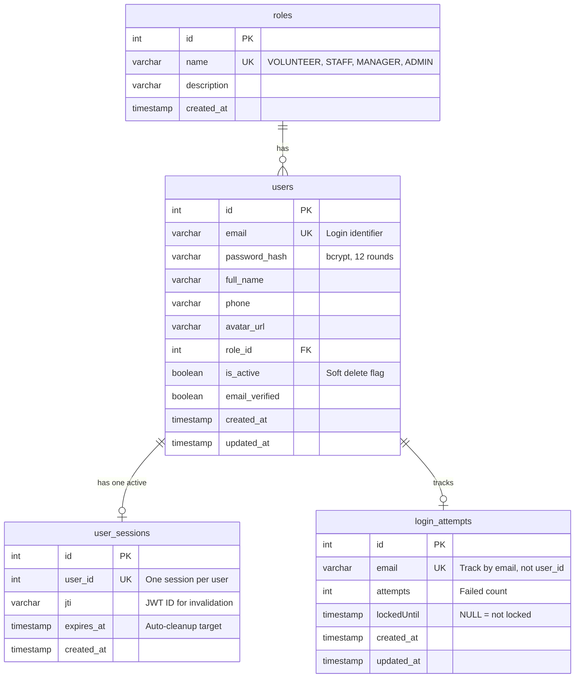

# data-model.md — Phase 1: Data Model for UC03 Authentication Login

**Feature**: UC03-feat-auth-login  
**Date**: 2026-06-29  
**Owner**: Member 1 - CuongLH

---

## Overview

UC03 Authentication Login sử dụng 5 database tables để implement secure login với Single Active Session và Account Lockout protection.

**Tables**:

1. `users` — User accounts (existing, defined in DATABASE.md)
2. `roles` — User roles (existing, seed data)
3. `user_sessions` — Single Active Session tracking (NEW)
4. `login_attempts` — Brute-force protection (NEW)
5. `email_verifications` — Email verification & password reset OTP (existing)

---

## Entity Relationship Diagram



---

## Table: `roles`

**Owner**: Member 1 - CuongLH  
**Purpose**: Định nghĩa các vai trò trong hệ thống  
**Soft Delete**: No (master data, rarely changes)  
**Source**: DATABASE.md Section 3.1

### Columns

| Column | Type | Constraints | Description |
|--------|------|-------------|-------------|
| `id` | INT | PRIMARY KEY, AUTO_INCREMENT | Role ID |
| `name` | VARCHAR(50) | UNIQUE, NOT NULL | Role name (VOLUNTEER, STAFF, MANAGER, ADMIN) |
| `description` | VARCHAR(255) | NULL | Role description |
| `created_at` | TIMESTAMP | DEFAULT CURRENT_TIMESTAMP | Creation timestamp |

### Indexes

- PRIMARY KEY (`id`)
- UNIQUE (`name`)

### Seed Data (Required)

```sql
INSERT INTO roles (name, description) VALUES
('VOLUNTEER', 'Tình nguyện viên tham gia sự kiện'),
('STAFF', 'Nhân viên quản lý sự kiện và xét duyệt'),
('MANAGER', 'Quản lý cấp trung, quản lý danh mục'),
('ADMIN', 'Quản trị viên hệ thống');
```

### Business Rules

1. `name` MUST be one of: VOLUNTEER, STAFF, MANAGER, ADMIN
2. CANNOT delete roles (no soft delete, no hard delete after seed)
3. Frontend routing logic depends on role names (exact match required)

---

## Table: `users`

**Owner**: Member 1 - CuongLH  
**Purpose**: Lưu trữ tài khoản người dùng  
**Soft Delete**: Yes (`is_active` flag)  
**Source**: DATABASE.md Section 3.1

### Columns

| Column | Type | Constraints | Description |
|--------|------|-------------|-------------|
| `id` | INT | PRIMARY KEY, AUTO_INCREMENT | User ID |
| `email` | VARCHAR(255) | UNIQUE, NOT NULL | Email đăng nhập (lowercase) |
| `password_hash` | VARCHAR(255) | NOT NULL | Bcrypt hash (12 rounds) |
| `full_name` | VARCHAR(255) | NOT NULL | Họ tên đầy đủ |
| `phone` | VARCHAR(20) | NULL | Số điện thoại |
| `avatar_url` | VARCHAR(500) | NULL | Cloudinary URL |
| `role_id` | INT | FOREIGN KEY → roles.id, NOT NULL | Vai trò |
| `is_active` | BOOLEAN | DEFAULT TRUE, NOT NULL | Trạng thái hoạt động (soft delete) |
| `email_verified` | BOOLEAN | DEFAULT FALSE, NOT NULL | Email đã xác thực |
| `created_at` | TIMESTAMP | DEFAULT CURRENT_TIMESTAMP | Creation timestamp |
| `updated_at` | TIMESTAMP | ON UPDATE CURRENT_TIMESTAMP | Last update timestamp |

### Indexes

- PRIMARY KEY (`id`)
- UNIQUE (`email`)
- INDEX (`role_id`)
- INDEX (`is_active`)
- INDEX (`email_verified`)

### Business Rules for UC03

1. **Login Eligibility**:
   - `isActive = TRUE` (MUST check before allow login)
   - `emailVerified = TRUE` (MUST check before allow login, return 403 if false)

2. **Password Storage**:
   - MUST be bcrypt hashed with 12 salt rounds
   - NEVER store plaintext password
   - `passwordHash` MUST NOT be returned in API responses

3. **Email Normalization**:
   - Store email in lowercase for case-insensitive lookup
   - Example: "<User@Example.COM>" → "<user@example.com>"

4. **Soft Delete**:
   - Set `is_active = FALSE` instead of DELETE
   - Preserve audit trail và foreign key references

### Validation Rules (Zod Schema)

```javascript
// Login validation (UC03 scope)
const loginSchema = z.object({
  email: z.string().email().toLowerCase(),
  password: z.string().min(1) // Don't validate strength on login, only check existence
});
```

---

## Table: `user_sessions`

**Owner**: Member 1 - CuongLH  
**Purpose**: Single Active Session enforcement (JWT jti tracking)  
**Soft Delete**: No (auto-expire via TTL, cleanup job)  
**Source**: DATABASE.md Section 3.1

### Columns

| Column | Type | Constraints | Description |
|--------|------|-------------|-------------|
| `id` | INT | PRIMARY KEY, AUTO_INCREMENT | Session ID |
| `user_id` | INT | **UNIQUE**, FOREIGN KEY → users.id, NOT NULL | User sở hữu session (1-to-1) |
| `jti` | VARCHAR(255) | NOT NULL | JWT ID (unique identifier per token) |
| `expires_at` | TIMESTAMP | NOT NULL | Session expiry time (7 days from creation) |
| `created_at` | TIMESTAMP | DEFAULT CURRENT_TIMESTAMP | Session creation timestamp |

### Indexes

- PRIMARY KEY (`id`)
- **UNIQUE (`user_id`)** ← CRITICAL: Enforce 1 session per user
- INDEX (`jti`) ← Fast lookup when validating JWT
- INDEX (`expires_at`) ← Cleanup job query optimization

### Business Rules

1. **Single Active Session**:
   - UNIQUE constraint on `user_id` ensures 1 user = 1 session max
   - When user login mới → UPSERT operation:

     ```sql
     INSERT INTO user_sessions (user_id, jti, expires_at)
     VALUES (?, ?, ?)
     ON DUPLICATE KEY UPDATE jti = VALUES(jti), expires_at = VALUES(expires_at), created_at = NOW()
     ```

   - Old `jti` bị ghi đè → Old JWT becomes invalid

2. **JWT Validation Flow**:

   ```
   1. Decode JWT → extract {userId, jti}
   2. SELECT jti FROM user_sessions WHERE user_id = ?
   3. IF jti matches → Valid session
   4. IF jti mismatch → Invalid session (401 Unauthorized)
   5. IF no record → Invalid session (401 Unauthorized)
   ```

3. **Expiry & Cleanup**:
   - `expiresAt` = `createdAt` + 7 days (match JWT TTL)
   - Cron job xóa expired sessions: `DELETE FROM user_sessions WHERE expiresAt < NOW()`
   - Run frequency: Every 1 hour (low priority, não critical)

4. **Session Revocation**:
   - Logout (UC05): DELETE FROM user_sessions WHERE user_id = ?
   - Force logout: DELETE session record

### State Transitions

```
[No Session] 
    ↓ Login (UC03)
[Active Session with jti_1]
    ↓ Login Again (UC03) - UPSERT
[Active Session with jti_2] ← jti_1 overwritten, old JWT invalid
    ↓ Token Expires (7 days)
[Expired Session] ← Cleanup job removes
    ↓
[No Session]
```

---

## Table: `login_attempts`

**Owner**: Member 1 - CuongLH  
**Purpose**: Account Lockout tracking (brute-force protection)  
**Soft Delete**: No (auto-expire via TTL logic)  
**Source**: DATABASE.md Section 3.1

### Columns

| Column | Type | Constraints | Description |
|--------|------|-------------|-------------|
| `id` | INT | PRIMARY KEY, AUTO_INCREMENT | Attempt ID |
| `email` | VARCHAR(255) | **UNIQUE**, NOT NULL | Email đang bị track (lowercase) |
| `attempts` | INT | DEFAULT 0, NOT NULL | Số lần nhập sai liên tiếp |
| `lockedUntil` | TIMESTAMP | NULL | Thời điểm mở khóa (NULL = not locked) |
| `created_at` | TIMESTAMP | DEFAULT CURRENT_TIMESTAMP | First failed attempt timestamp |
| `updated_at` | TIMESTAMP | ON UPDATE CURRENT_TIMESTAMP | Last attempt timestamp |

### Indexes

- PRIMARY KEY (`id`)
- **UNIQUE (`email`)** ← One record per email
- INDEX (`lockedUntil`) ← Fast check for locked accounts

### Business Rules

1. **Tracking Logic**:
   - Track by `email`, NOT `user_id` (vì user có thể chưa tồn tại)
   - Email normalized to lowercase (match users.email format)

2. **Failed Attempt Flow**:

   ```
   IF password incorrect:
     IF loginAttempt record exists:
       INCREMENT attempts
       IF attempts >= 5:
         SET lockedUntil = NOW() + INTERVAL 15 MINUTE
     ELSE:
       INSERT loginAttempt (email, attempts = 1)
   ```

3. **Lockout Check** (Before password verify):

   ```
   SELECT lockedUntil FROM loginAttempt WHERE email = ?
   IF lockedUntil > NOW():
     RETURN 429 "Account locked. Try again after {lockedUntil}"
   ```

4. **Successful Login**:

   ```
   DELETE FROM loginAttempt WHERE email = ?
   -- OR --
   UPDATE loginAttempt SET attempts = 0, lockedUntil = NULL WHERE email = ?
   ```

   Decision: **DELETE** approach (cleaner, record only exists when có failed attempts)

5. **Auto-Unlock**:
   - After 15 minutes: `lockedUntil < NOW()` → Account tự động unlocked
   - User thử login → Lockout check passes → Cho phép verify password

6. **Cleanup** (Optional):
   - Xóa old records (attempts = 0 AND updated_at < NOW() - 30 days)
   - Low priority, không critical cho UC03

### State Transitions

```
[No Record]
    ↓ 1st Failed Login
[attempts = 1, lockedUntil = NULL]
    ↓ 2nd-4th Failed Login
[attempts = 2-4, lockedUntil = NULL]
    ↓ 5th Failed Login
[attempts = 5, lockedUntil = NOW() + 15 min] ← LOCKED
    ↓ Wait 15 minutes
[lockedUntil < NOW()] ← Auto-unlocked
    ↓ Successful Login
[Record DELETED]
```

---

---

## Table: `email_verifications`

**Owner**: Member 1 - CuongLH  
**Purpose**: Luu tru OTP hash cho email verification va password reset  
**Soft Delete**: No (records deleted after successful verification)  
**Source**: backend/prisma/schema.prisma

### Columns

| Column | Type | Constraints | Description |
|--------|------|-------------|-------------|
| `id` | INT | PRIMARY KEY, AUTO_INCREMENT | Record ID |
| `email` | VARCHAR(255) | NOT NULL | Email dang duoc xac thuc |
| `otp_hash` | VARCHAR(255) | NOT NULL | Bcrypt hash cua OTP code |
| `type` | ENUM | NOT NULL, DEFAULT 'REGISTER' | REGISTER hoac RESET_PASSWORD |
| `created_at` | TIMESTAMP | DEFAULT CURRENT_TIMESTAMP | OTP creation timestamp |
| `last_sent_at` | TIMESTAMP | NULL | Last OTP sent timestamp (rate limiting) |
| `attempts` | INT | DEFAULT 0 | So lan verify OTP that bai |
| `is_locked` | BOOLEAN | DEFAULT FALSE | OTP lockout flag |
| `locked_until` | TIMESTAMP | NULL | Thoi diem mo khoa OTP |

### Indexes

- PRIMARY KEY (`id`)
- **UNIQUE (`email`, `type`)** <- One verification record per email per type
- INDEX (`email`)
- INDEX (`created_at`)
- INDEX (`locked_until`)

### Business Rules

1. **OTP Scope**:
   - `type = REGISTER`: OTP gui khi dang ky tai khoan moi
   - `type = RESET_PASSWORD`: OTP gui khi quen mat khau

2. **OTP Lifecycle**:
   - OTP het han sau 5 phut (`createdAt + 5 minutes`)
   - OTP bi xoa sau khi verify thanh cong
   - Resend OTP: kiem tra `lastSentAt` de rate limit (60s cooldown)

3. **Lockout**:
   - Sau 5 lan verify OTP sai -> `isLocked = TRUE`, `lockedUntil = NOW() + 15 min`
   - Khi locked, khong the verify OTP (ke ca OTP dung)

## Relationships Summary

### One-to-Many

**roles → users** (1:N)

- One role can be assigned to many users
- Foreign Key: `users.roleId` → roles.id
- ON DELETE: RESTRICT (cannot delete role if users exist)

### One-to-One

**users ↔ user_sessions** (1:0..1)

- One user has AT MOST one active session
- Foreign Key: `user_sessions.userId` → `users.id`
- UNIQUE constraint on `user_id` enforces 1:1
- ON DELETE: CASCADE (delete session when user deleted)

### One-to-One (Loose)

**users ↔ login_attempts** (1:0..1)

- One user (identified by email) has AT MOST one lockout record
- NO foreign key (email may not exist in users yet)
- UNIQUE constraint on `email` enforces 1:1
- Record exists ONLY when failed attempts > 0

---

## Prisma Schema

```prisma
// Excerpt từ backend/prisma/schema.prisma

model Role {
  id          Int      @id @default(autoincrement())
  name        String   @unique @db.VarChar(50)
  description String?  @db.VarChar(255)
  createdAt   DateTime @default(now()) @map("created_at")
  
  users       User[]
  
  @@map("roles")
}

model User {
  id              Int       @id @default(autoincrement())
  email           String    @unique @db.VarChar(255)
  passwordHash    String    @db.VarChar(255) @map("password_hash")
  fullName        String    @db.VarChar(255) @map("full_name")
  phone           String?   @db.VarChar(20)
  avatarUrl       String?   @db.VarChar(500) @map("avatar_url")
  roleId          Int       @map("role_id")
  isActive        Boolean   @default(true) @map("is_active")
  emailVerified   Boolean   @default(false) @map("email_verified")
  createdAt       DateTime  @default(now()) @map("created_at")
  updatedAt       DateTime  @updatedAt @map("updated_at")

  role            Role      @relation(fields: [roleId], references: [id])
  session         UserSession?
  
  @@index([roleId])
  @@index([isActive])
  @@index([emailVerified])
  @@map("users")
}

model UserSession {
  id        Int      @id @default(autoincrement())
  userId    Int      @unique @map("user_id")
  jti       String   @db.VarChar(255)
  expiresAt DateTime @map("expires_at")
  createdAt DateTime @default(now()) @map("created_at")

  user      User     @relation(fields: [userId], references: [id], onDelete: Cascade)

  @@index([jti])
  @@index([expiresAt])
  @@map("user_sessions")
}

model LoginAttempt {
  id          Int       @id @default(autoincrement())
  email       String    @unique @db.VarChar(255)
  attempts    Int       @default(0)
  lockedUntil DateTime? @map("lockedUntil")
  createdAt   DateTime  @default(now()) @map("created_at")
  updatedAt   DateTime  @updatedAt @map("updated_at")

  @@index([lockedUntil])
  @@map("login_attempts")
}

model EmailVerification {
  id          Int                   @id @default(autoincrement())
  email       String                @db.VarChar(255)
  otpHash     String                @db.VarChar(255) @map("otp_hash")
  type        EmailVerificationType @default(REGISTER)
  createdAt   DateTime              @default(now()) @map("created_at")
  lastSentAt  DateTime?             @map("last_sent_at")
  attempts    Int                   @default(0)
  isLocked    Boolean               @default(false) @map("is_locked")
  lockedUntil DateTime?             @map("lockedUntil")

  @@unique([email, type])
  @@index([email])
  @@index([createdAt])
  @@index([lockedUntil])
  @@map("email_verifications")
}
```

---

## Migration Strategy

### Migration Order

1. **Migration 001**: Create `roles` table + seed data (if not exists)
2. **Migration 002**: Create `users` table (if not exists)
3. **Migration 003**: Create `user_sessions` table (NEW for UC03)
4. **Migration 004**: Create `login_attempts` table (NEW for UC03)
5. **Migration 005**: Create `email_verifications` table (existing)

### Migration Files

**File**: `backend/prisma/migrations/20260629_create_user_sessions/migration.sql`

```sql
CREATE TABLE IF NOT EXISTS `user_sessions` (
  `id` INT NOT NULL AUTO_INCREMENT,
  `user_id` INT NOT NULL,
  `jti` VARCHAR(255) NOT NULL,
  `expires_at` TIMESTAMP NOT NULL,
  `created_at` TIMESTAMP NOT NULL DEFAULT CURRENT_TIMESTAMP,
  PRIMARY KEY (`id`),
  UNIQUE KEY `user_sessions_user_id_key` (`user_id`),
  KEY `user_sessions_jti_idx` (`jti`),
  KEY `user_sessions_expires_at_idx` (`expires_at`),
  CONSTRAINT `user_sessions_user_id_fkey` FOREIGN KEY (`user_id`) REFERENCES `users` (`id`) ON DELETE CASCADE ON UPDATE CASCADE
) ENGINE=InnoDB DEFAULT CHARSET=utf8mb4 COLLATE=utf8mb4_unicode_ci;
```

**File**: `backend/prisma/migrations/20260629_create_login_attempts/migration.sql`

```sql
CREATE TABLE IF NOT EXISTS `login_attempts` (
  `id` INT NOT NULL AUTO_INCREMENT,
  `email` VARCHAR(255) NOT NULL,
  `attempts` INT NOT NULL DEFAULT 0,
  `lockedUntil` TIMESTAMP NULL DEFAULT NULL,
  `created_at` TIMESTAMP NOT NULL DEFAULT CURRENT_TIMESTAMP,
  `updated_at` TIMESTAMP NOT NULL DEFAULT CURRENT_TIMESTAMP ON UPDATE CURRENT_TIMESTAMP,
  PRIMARY KEY (`id`),
  UNIQUE KEY `login_attempts_email_key` (`email`),
  KEY `login_attempts_lockedUntil_idx` (`lockedUntil`)
) ENGINE=InnoDB DEFAULT CHARSET=utf8mb4 COLLATE=utf8mb4_unicode_ci;
```

---

## Data Integrity Constraints

### Enforced by Database

✅ **UNIQUE(users.email)** — Prevent duplicate accounts

✅ **UNIQUE(user_sessions.userId)** — Enforce Single Active Session

✅ **UNIQUE(login_attempts.email)** — One lockout record per email

✅ **FOREIGN KEY(user_sessions.userId → users.id)** — Cascade delete sessions when user deleted

✅ **FOREIGN KEY(users.roleId → roles.id)** — Restrict role deletion

### Enforced by Application (Service Layer)

⚠️ **Soft delete check**: `users.isActive = TRUE` before login

⚠️ **Lockout check**: `lockedUntil < NOW()` before password verify

⚠️ **jti validation**: JWT jti must match `userSessions.jti`

⚠️ **Email normalization**: Lowercase email before DB operations

---

## Query Patterns

### Login Flow Queries

```javascript
// 1. Check lockout
const lockout = await prisma.loginAttempt.findUnique({
  where: { email: normalizedEmail }
});

// 2. Find user
const user = await prisma.user.findUnique({
  where: { email: normalizedEmail },
  include: { role: true }
});

// 3. Verify password (bcrypt, not query)

// 4. Upsert session
await prisma.userSession.upsert({
  where: { userId: user.id },
  create: { userId: user.id, jti, expiresAt },
  update: { jti, expiresAt }
});

// 5. Delete login attempts
await prisma.loginAttempt.delete({
  where: { email: normalizedEmail }
});
```

### JWT Validation Query

```javascript
const session = await prisma.userSession.findUnique({
  where: { userId: decodedJWT.userId }
});

if (!session || session.jti !== decodedJWT.jti) {
  throw new Error('Invalid session');
}
```

---

## Performance Considerations

### Indexes Justification

| Index | Query Pattern | Impact |
|-------|--------------|--------|
| `users.email` UNIQUE | Login lookup by email | Essential (every login) |
| `users.roleId` INDEX | Join with roles table | Medium (every login for role info) |
| `users.isActive` INDEX | Filter active users | Low (small cardinality) |
| `user_sessions.userId` UNIQUE | 1-to-1 enforcement + session lookup | Essential (every authenticated request) |
| `userSessions.jti` INDEX | JWT validation | Essential (every authenticated request) |
| `user_sessions.expires_at` INDEX | Cleanup job query | Low (cron job only) |
| `login_attempts.email` UNIQUE | Lockout check | Essential (every login) |
| `login_attempts.lockedUntil` INDEX | Lockout expiry check | Medium (every login with failed attempts) |
| `email_verifications.email_type` UNIQUE | OTP lookup per email per type | Essential (register/reset password) |
| `email_verifications.lockedUntil` INDEX | OTP lockout check | Medium (verify OTP flow) |

### Query Performance Estimates

| Operation | Estimated Time | Frequency |
|-----------|---------------|-----------|
| Find user by email | ~5-10ms | Every login |
| Check lockout | ~5ms | Every login |
| Upsert session | ~10-15ms | Every login |
| Validate JWT jti | ~5ms | Every authenticated request |
| Cleanup expired sessions | ~50-100ms | Hourly cron job |

**Total Login Latency (DB only)**: ~30-40ms  
**Total Login + bcrypt**: ~280-290ms (acceptable per research.md)

---

**END OF DATA-MODEL.MD**
