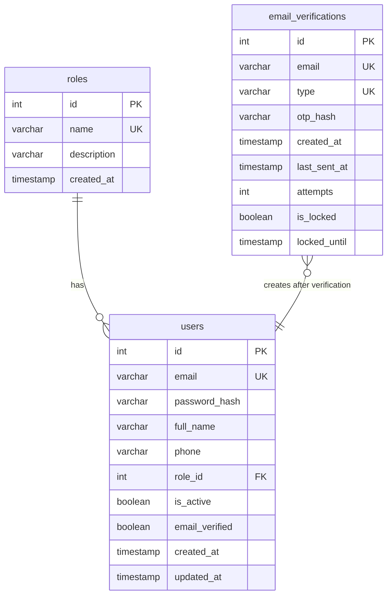

# Data Model: Authentication Register (UC04)

**Feature**: UC04 - Authentication Register with OTP Email Verification

**Date**: 2026-06-29

**Status**: APPROVED

---

## Overview

This document defines the database schema, entity relationships, and data flow for the registration feature. The data model consists of 3 tables: `users` (existing, modified), `roles` (existing, read-only), and `email_verifications` (new).

---

## Entities

### 1. EmailVerification (NEW TABLE)

**Purpose**: Temporary storage for OTP verification state during registration flow

**Table Name**: `email_verifications`

**Lifecycle**: Created when OTP sent → Deleted when OTP verified successfully or TTL expired

**Fields**:

| Field | Type | Constraints | Description |
|-------|------|-------------|-------------|
| id | INT | PRIMARY KEY, AUTO_INCREMENT | Verification ID |
| email | VARCHAR(255) | NOT NULL | User's email address (normalized: lowercase, trimmed) |
| type | ENUM | NOT NULL, DEFAULT 'REGISTER' | 'REGISTER' or 'RESET_PASSWORD' |
| otp_hash | VARCHAR(255) | NOT NULL | bcrypt hash of 6-digit OTP (never store plaintext) |
| created_at | TIMESTAMP | NOT NULL, DEFAULT CURRENT_TIMESTAMP | OTP generation timestamp (for TTL check) |
| last_sent_at | TIMESTAMP | NULL | Last OTP send timestamp (for cooldown) |
| attempts | INT | NOT NULL, DEFAULT 0 | Failed verification attempts counter |
| is_locked | BOOLEAN | NOT NULL, DEFAULT FALSE | Lockout flag (true after 5 failed attempts) |
| locked_until | TIMESTAMP | NULL | Lockout expiration timestamp (null if not locked) |

**Indexes**:

```sql
PRIMARY KEY (id)
UNIQUE (email, type)
INDEX idx_locked_until (locked_until) -- For cleanup queries
```

**Business Rules**:

1. **Uniqueness**: One email can only have one pending verification at a time per type (enforced by UNIQUE(email, type))
2. **TTL**: OTP expires 10 minutes after `created_at`
3. **Cooldown**: Cannot resend OTP within 60 seconds of `last_sent_at`
4. **Lockout**: After 5 failed attempts (`attempts >= 5`), set `is_locked = TRUE` and `locked_until = NOW() + 15 minutes`
5. **Cleanup**: Records with `created_at < NOW() - 10 minutes` should be deleted (cron job or lazy deletion)

**State Transitions**:

```text
[CREATED] → OTP sent, attempts=0, is_locked=false
    ↓
[PENDING] → User can verify OTP or resend (if cooldown passed)
    ↓
    ├─[VERIFIED] → User created in users table, record DELETED
    ├─[EXPIRED] → created_at > 10 min, record DELETED on next access
    └─[LOCKED] → attempts >= 5, is_locked=true, locked_until set
         ↓
         └─[UNLOCKED] → locked_until < NOW(), reset attempts=0, is_locked=false
```

**Sample Data**:

```sql
-- Active verification (pending)
INSERT INTO email_verifications (email, type, otp_hash, created_at, last_sent_at, attempts, is_locked, locked_until)
VALUES ('user@vms.com', 'REGISTER', '$2a$10$...', '2026-06-29 10:00:00', '2026-06-29 10:00:00', 0, FALSE, NULL);

-- Locked verification (5 failed attempts)
INSERT INTO email_verifications (email, type, otp_hash, created_at, last_sent_at, attempts, is_locked, locked_until)
VALUES ('locked@vms.com', 'REGISTER', '$2a$10$...', '2026-06-29 09:50:00', '2026-06-29 09:50:00', 5, TRUE, '2026-06-29 10:05:00');
```

---

### 2. User (EXISTING TABLE, MODIFIED)

**Purpose**: Store registered user accounts

**Table Name**: `users`

**Lifecycle**: Created after successful OTP verification → Soft deleted when account deactivated

**Fields** (only registration-relevant fields shown):

| Field | Type | Constraints | Description |
|-------|------|-------------|-------------|
| id | INT | PRIMARY KEY, AUTO_INCREMENT | User ID |
| email | VARCHAR(255) | UNIQUE, NOT NULL | Login email (must match verified email) |
| password_hash | VARCHAR(255) | NOT NULL | bcrypt hash of password (12 rounds) |
| full_name | VARCHAR(255) | NOT NULL | User's full name |
| phone | VARCHAR(20) | NULL | Phone number (10-11 digits) |
| role_id | INT | FOREIGN KEY → roles.id, NOT NULL | User role (Volunteer for new registrations) |
| is_active | BOOLEAN | NOT NULL, DEFAULT TRUE | Account active status |
| email_verified | BOOLEAN | NOT NULL, DEFAULT FALSE | Email verified status |
| created_at | TIMESTAMP | NOT NULL, DEFAULT CURRENT_TIMESTAMP | Account creation time |
| updated_at | TIMESTAMP | ON UPDATE CURRENT_TIMESTAMP | Last update time |

**Registration-Specific Validation**:

1. **Email**: Must be unique (checked before sending OTP)
2. **Password**: Min 8 chars, must contain uppercase, lowercase, digit (validated before hash)
3. **Full Name**: 1-255 characters, required
4. **Phone Number**: 10-11 digits, starts with 0 (Vietnam format)
5. **Role**: Automatically set to Volunteer role_id from roles table
6. **is_active**: Set to TRUE on registration (no admin approval required)
7. **email_verified**: Set to TRUE on registration (since OTP was verified)

**Sample Data**:

```sql
-- New volunteer account created after OTP verification
INSERT INTO users (email, password_hash, full_name, phone, role_id, is_active, email_verified)
VALUES ('volunteer@vms.com', '$2a$12$...', 'Nguyễn Văn A', '0912345678', 1, TRUE, TRUE);
```

---

### 3. Role (EXISTING TABLE, READ-ONLY)

**Purpose**: Define user roles in the system

**Table Name**: `roles`

**Lifecycle**: Seeded at database initialization, rarely changed

**Fields**:

| Field | Type | Constraints | Description |
|-------|------|-------------|-------------|
| id | INT | PRIMARY KEY, AUTO_INCREMENT | Role ID |
| name | VARCHAR(50) | UNIQUE, NOT NULL | Role name (VOLUNTEER, STAFF, MANAGER, ADMIN) |
| description | VARCHAR(255) | NULL | Role description |
| created_at | TIMESTAMP | DEFAULT CURRENT_TIMESTAMP | Creation time |

**Registration Usage**:

During user creation, the system queries:

```sql
SELECT id FROM roles WHERE name = 'VOLUNTEER' LIMIT 1;
```

Then sets `users.role_id = <volunteer_role_id>`.

**Seed Data**:

```sql
INSERT INTO roles (name, description) VALUES
('VOLUNTEER', 'Tình nguyện viên tham gia sự kiện'),
('STAFF', 'Nhân viên quản lý sự kiện'),
('MANAGER', 'Quản lý cấp trung'),
('ADMIN', 'Quản trị viên hệ thống');
```

---

## Entity Relationships



**Relationships**:

1. **roles → users**: One-to-Many (one role has many users)
   - Foreign Key: `users.role_id` references `roles.id`
   - On Delete: RESTRICT (cannot delete role if users exist)

2. **email_verifications → users**: One-to-Zero-or-One (verification creates user after success)
   - NOT a database FK (email_verifications is temporary)
   - Business rule: `email_verifications.email` must not exist in `users.email` before sending OTP
   - After verification: User created with same email, verification record deleted

---

## Data Flow

### Flow 1: Send OTP (Step 1)

```text
Guest Input:
  └─ email: "user@vms.com"

Backend Validation:
  1. Normalize email → "user@vms.com" (lowercase, trim)
  2. Check users table → email must NOT exist (409 if exists)
  3. Check email_verifications table:
     - If record exists:
       a. Check is_locked and locked_until (429 if locked)
       b. Check cooldown: last_sent_at + 60s > NOW() (429 if too soon)
     - If no record: Proceed
  4. Generate OTP: crypto.randomInt(100000, 999999) → "123456"
  5. Hash OTP: bcrypt.hash("123456", 10) → "$2a$10$..."
  6. Upsert email_verifications:
     - email = "user@vms.com"
     - type = "REGISTER"
     - otp_hash = "$2a$10$..."
     - created_at = NOW()
     - last_sent_at = NOW()
     - attempts = 0
     - is_locked = FALSE
     - locked_until = NULL
  7. Send email with plaintext OTP "123456"
  8. Return 200 success

Database State After:
  email_verifications: 1 record inserted/updated
  users: No change
```

### Flow 2: Verify OTP (Step 2)

```text
Guest Input:
  └─ email: "user@vms.com"
  └─ otp: "123456"
  └─ full_name: "Nguyễn Văn A"
  └─ phone: "0912345678"
  └─ password: "Password123"

Backend Validation:
  1. Validate all fields with Zod schema
  2. Lookup email_verifications WHERE email = "user@vms.com"
     - If not found: 400 "Không tìm thấy yêu cầu xác thực"
  3. Check is_locked and locked_until:
     - If is_locked = TRUE AND locked_until > NOW(): 429 "Email đã bị khóa"
     - If is_locked = TRUE AND locked_until <= NOW(): Reset lock (is_locked = FALSE, attempts = 0)
  4. Check TTL: created_at + 10 minutes > NOW()
     - If expired: 400 "Mã OTP đã hết hạn"
  5. Verify OTP: bcrypt.compare("123456", otp_hash)
     - If wrong:
       a. Increment attempts += 1
       b. If attempts >= 5: Set is_locked = TRUE, locked_until = NOW() + 15 min
       c. Return 400 "Mã OTP không đúng. Bạn còn X lần thử"
     - If correct: Proceed
  6. BEGIN TRANSACTION
     a. Get Volunteer role_id: SELECT id FROM roles WHERE name = 'VOLUNTEER'
     b. Hash password: bcrypt.hash("Password123", 12) → "$2a$12$..."
     c. INSERT INTO users:
        - email = "user@vms.com"
        - password_hash = "$2a$12$..."
        - full_name = "Nguyễn Văn A"
        - phone = "0912345678"
        - role_id = <volunteer_id>
        - is_active = TRUE
        - email_verified = TRUE
     d. DELETE FROM email_verifications WHERE email = "user@vms.com" AND type = "REGISTER"
  7. COMMIT TRANSACTION
  8. Return 201 success with user_id

Database State After:
  users: 1 record inserted
  email_verifications: 1 record deleted
```

### Flow 3: Resend OTP

```text
Guest Action: Click "Gửi lại OTP" from Step 2

Backend Processing:
  1. Same as "Send OTP" flow
  2. If email still in email_verifications:
     - Check cooldown (last_sent_at + 60s)
     - Generate NEW OTP
     - UPDATE existing record (don't insert new)
     - Reset attempts = 0 (fresh start)
  3. Send new email with new OTP
  4. Return 200 success

Database State After:
  email_verifications: 1 record updated (new otp_hash, new last_sent_at)
```

---

## Prisma Schema

```prisma
enum OtpType {
  REGISTER
  RESET_PASSWORD
}

model EmailVerification {
  id           Int      @id @default(autoincrement())
  email        String   @db.VarChar(255)
  type         OtpType  @default(REGISTER)
  otp_hash     String   @db.VarChar(255)
  created_at   DateTime @default(now()) @db.Timestamp(0)
  last_sent_at DateTime? @db.Timestamp(0)
  attempts     Int      @default(0) @db.Int
  is_locked    Boolean  @default(false) @db.TinyInt
  locked_until DateTime? @db.Timestamp(0)

  @@unique([email, type])
  @@index([locked_until], map: "idx_locked_until")
  @@map("email_verifications")
}

model User {
  id            Int      @id @default(autoincrement())
  email         String   @unique @db.VarChar(255)
  password_hash String   @db.VarChar(255)
  full_name     String   @db.VarChar(255)
  phone         String?  @db.VarChar(20)
  role_id       Int
  is_active     Boolean  @default(true) @db.TinyInt
  email_verified Boolean  @default(false) @db.TinyInt
  created_at    DateTime @default(now()) @db.Timestamp(0)
  updated_at    DateTime @updatedAt @db.Timestamp(0)

  role Role @relation(fields: [role_id], references: [id], onDelete: Restrict)

  @@index([role_id], map: "idx_role_id")
  @@index([email], map: "idx_email")
  @@map("users")
}

model Role {
  id          Int      @id @default(autoincrement())
  name        String   @unique @db.VarChar(50)
  description String?  @db.VarChar(255)
  created_at  DateTime @default(now()) @db.Timestamp(0)

  users User[]

  @@map("roles")
}
```

---

## Migration Strategy

### Step 1: Create Migration

```bash
npx prisma migrate dev --name add_email_verifications_table
```

### Step 2: Generated SQL

```sql
-- Create email_verifications table
CREATE TABLE email_verifications (
  id INT AUTO_INCREMENT PRIMARY KEY,
  email VARCHAR(255) NOT NULL,
  type ENUM('REGISTER', 'RESET_PASSWORD') NOT NULL DEFAULT 'REGISTER',
  otp_hash VARCHAR(255) NOT NULL,
  created_at TIMESTAMP NOT NULL DEFAULT CURRENT_TIMESTAMP,
  last_sent_at TIMESTAMP NULL,
  attempts INT NOT NULL DEFAULT 0,
  is_locked TINYINT(1) NOT NULL DEFAULT 0,
  locked_until TIMESTAMP NULL,
  UNIQUE KEY unique_email_type (email, type),
  INDEX idx_locked_until (locked_until)
) ENGINE=InnoDB DEFAULT CHARSET=utf8mb4 COLLATE=utf8mb4_unicode_ci;
```

### Step 3: Verify Migration

```bash
npx prisma migrate status
npx prisma generate
```

---

## Data Cleanup Strategy

### Automatic Cleanup (Cron Job)

```javascript
// Scheduled job (run every hour)
async function cleanupExpiredVerifications() {
  const TEN_MINUTES_AGO = new Date(Date.now() - 10 * 60 * 1000);
  
  await prisma.emailVerification.deleteMany({
    where: {
      created_at: {
        lt: TEN_MINUTES_AGO
      }
    }
  });
  
  console.log('Cleaned up expired email verifications');
}
```

### Lazy Cleanup (On-Demand)

```javascript
// Called before sending new OTP or verifying
async function cleanupIfExpired(email) {
  const record = await prisma.emailVerification.findUnique({
    where: { email_type: { email, type: 'REGISTER' } }
  });
  
  if (!record) return;
  
  const TEN_MINUTES_AGO = new Date(Date.now() - 10 * 60 * 1000);
  
  if (record.created_at < TEN_MINUTES_AGO) {
    await prisma.emailVerification.delete({
      where: { email_type: { email, type: 'REGISTER' } }
    });
  }
}
```

---

## Validation Rules Summary

| Field | Validation | Enforced By |
|-------|-----------|-------------|
| email | Email format, unique in users | Zod + Database constraint |
| otp | 6 digits, matches hash, not expired | Zod + bcrypt + Timestamp check |
| full_name | 1-255 chars, required | Zod |
| phone_number | 10-11 digits, starts with 0 | Zod regex `/^0\d{9,10}$/` |
| password | Min 8, uppercase, lowercase, digit | Zod regex |
| attempts | 0-5, auto-lock at 5 | Business logic in service |
| TTL | 10 minutes from created_at | Timestamp comparison |
| Cooldown | 60 seconds from last_sent_at | Timestamp comparison |

---

**Data Model Status**: ✅ COMPLETE - Ready for implementation
