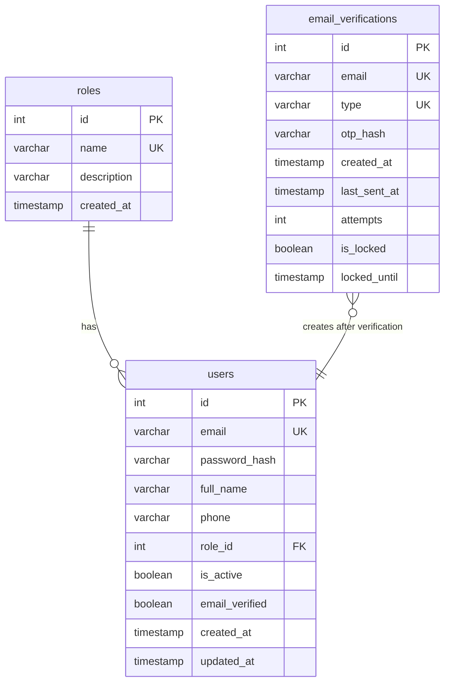

# Data Model: Authentication Register (UC04)

**Feature**: UC04 - Authentication Register with OTP Email Verification

**Date**: 2026-06-29

**Status**: APPROVED

---

## Overview (Tổng quan)

This document defines the database schema, entity relationships, and data flow for the registration feature. The data model consists of 3 tables: `users` (existing, modified), `roles` (existing, read-only), and `email_verifications` (new).

---

## Entities (Thực thể)

### 1. EmailVerification (NEW TABLE)

**Purpose (Mục đích):** Lưu trữ tạm thời trạng thái xác thực OTP trong quá trình đăng ký

**Table Name (Tên bảng):** `email_verifications`

**Lifecycle (Vòng đời):** Tạo khi gửi OTP → Xóa khi OTP được xác thực thành công hoặc TTL hết hạn

**Fields (Trường dữ liệu):**

| Field | Type | Constraints | Description |
|-------|------|-------------|-------------|
| id | INT | PRIMARY KEY, AUTO_INCREMENT | ID bản ghi xác thực |
| email | VARCHAR(255) | NOT NULL | Địa chỉ email người dùng (chuẩn hóa: chữ thường, cắt khoảng trắng) |
| type | ENUM | NOT NULL, DEFAULT 'REGISTER' | 'REGISTER' (đăng ký) hoặc 'RESET_PASSWORD' (đặt lại mật khẩu) |
| otp_hash | VARCHAR(255) | NOT NULL | Mã băm bcrypt của OTP 6 chữ số (không bao giờ lưu dạng văn bản thuần) |
| created_at | TIMESTAMP | NOT NULL, DEFAULT CURRENT_TIMESTAMP | Dấu thời gian tạo OTP (dùng để kiểm tra TTL) |
| last_sent_at | TIMESTAMP | NULL | Dấu thời gian gửi OTP lần cuối (dùng để kiểm tra thời gian chờ gửi lại) |
| attempts | INT | NOT NULL, DEFAULT 0 | Bộ đếm số lần xác thực thất bại |
| is_locked | BOOLEAN | NOT NULL, DEFAULT FALSE | Cờ khóa (true sau 5 lần thử thất bại) |
| locked_until | TIMESTAMP | NULL | Dấu thời gian hết hạn khóa (null nếu không bị khóa) |

**Indexes (Chỉ mục):**

```sql
PRIMARY KEY (id)
UNIQUE (email, type)
INDEX idx_locked_until (locked_until) -- For cleanup queries
```

**Business Rules (Quy tắc nghiệp vụ):**

1. **Tính duy nhất**: Mỗi email chỉ có một yêu cầu xác thực đang chờ tại một thời điểm cho mỗi loại (được đảm bảo bởi UNIQUE(email, type))
2. **TTL**: OTP expires 10 minutes after `created_at`
3. **Cooldown**: Cannot resend OTP within 60 seconds of `last_sent_at`
4. **Lockout**: After 5 failed attempts (`attempts >= 5`), set `is_locked = TRUE` and `locked_until = NOW() + 15 minutes`
5. **Cleanup**: Records with `created_at < NOW() - 10 minutes` should be deleted (cron job or lazy deletion)

**State Transitions (Chuyển đổi trạng thái):**

```text
[CREATED] → OTP sent, attempts=0, is_locked=false
    ↓
[PENDING] → User can verify OTP or resend (if cooldown passed)
    ↓
    ├─[VERIFIED] → User created in users table, record DELETED
    ├─[EXPIRED] → created_at > 10 min, record DELETED on next access
    └─[LOCKED] → attempts >= 5, is_locked=true, locked_until set
         ↓
         └─[UNLOCKED] → locked_until < NOW(), reset attempts=0, is_locked=false
```

**Sample Data (Dữ liệu mẫu):**

```sql
-- Xác thực đang hoạt động (đang chờ)
INSERT INTO email_verifications (email, type, otp_hash, created_at, last_sent_at, attempts, is_locked, locked_until)
VALUES ('user@vms.com', 'REGISTER', '$2a$10$...', '2026-06-29 10:00:00', '2026-06-29 10:00:00', 0, FALSE, NULL);

-- Xác thực bị khóa (5 lần thử thất bại)
INSERT INTO email_verifications (email, type, otp_hash, created_at, last_sent_at, attempts, is_locked, locked_until)
VALUES ('locked@vms.com', 'REGISTER', '$2a$10$...', '2026-06-29 09:50:00', '2026-06-29 09:50:00', 5, TRUE, '2026-06-29 10:05:00');
```

---

### 2. User (EXISTING TABLE, MODIFIED)

**Purpose (Mục đích):** Lưu trữ tài khoản người dùng đã đăng ký

**Table Name (Tên bảng):** `users`

**Lifecycle (Vòng đời):** Tạo sau khi xác thực OTP thành công → Xóa mềm khi tài khoản bị vô hiệu hóa

**Fields (Trường dữ liệu)** (only registration-relevant fields shown):

| Field | Type | Constraints | Description |
|-------|------|-------------|-------------|
| id | INT | PRIMARY KEY, AUTO_INCREMENT | ID người dùng |
| email | VARCHAR(255) | UNIQUE, NOT NULL | Email đăng nhập (phải khớp email đã xác thực) |
| password_hash | VARCHAR(255) | NOT NULL | Mã băm bcrypt của mật khẩu (12 vòng) |
| full_name | VARCHAR(255) | NOT NULL | Họ tên người dùng |
| phone | VARCHAR(20) | NULL | Số điện thoại (10-11 chữ số) |
| role_id | INT | FOREIGN KEY → roles.id, NOT NULL | Vai trò người dùng (Tình nguyện viên cho đăng ký mới) |
| is_active | BOOLEAN | NOT NULL, DEFAULT TRUE | Trạng thái kích hoạt tài khoản |
| email_verified | BOOLEAN | NOT NULL, DEFAULT FALSE | Trạng thái xác thực email |
| created_at | TIMESTAMP | NOT NULL, DEFAULT CURRENT_TIMESTAMP | Thời gian tạo tài khoản |
| updated_at | TIMESTAMP | ON UPDATE CURRENT_TIMESTAMP | Thời gian cập nhật lần cuối |

**Registration-Specific Validation (Kiểm tra đặc thù đăng ký):**

1. **Email**: Phải là duy nhất (kiểm tra trước khi gửi OTP)
2. **Mật khẩu**: Tối thiểu 8 ký tự, phải chứa chữ hoa, chữ thường, chữ số (kiểm tra trước khi băm)
3. **Họ tên**: 1-255 ký tự, bắt buộc
4. **Số điện thoại**: 10-11 chữ số, bắt đầu bằng 0 (định dạng Việt Nam)
5. **Vai trò**: Tự động đặt thành role_id của Tình nguyện viên từ bảng roles
6. **is_active**: Đặt thành TRUE khi đăng ký (không cần phê duyệt của quản trị viên)
7. **email_verified**: Đặt thành TRUE khi đăng ký (vì OTP đã được xác thực)

**Sample Data (Dữ liệu mẫu):**

```sql
-- New volunteer account created after OTP verification
INSERT INTO users (email, password_hash, full_name, phone, role_id, is_active, email_verified)
VALUES ('volunteer@vms.com', '$2a$12$...', 'Nguyễn Văn A', '0912345678', 1, TRUE, TRUE);
```

---

### 3. Role (EXISTING TABLE, READ-ONLY)

**Purpose (Mục đích):** Định nghĩa vai trò người dùng trong hệ thống

**Table Name (Tên bảng):** `roles`

**Lifecycle (Vòng đời):** Được seed khi khởi tạo cơ sở dữ liệu, hiếm khi thay đổi

**Fields (Trường dữ liệu):**

| Field | Type | Constraints | Description |
|-------|------|-------------|-------------|
| id | INT | PRIMARY KEY, AUTO_INCREMENT | ID vai trò |
| name | VARCHAR(50) | UNIQUE, NOT NULL | Tên vai trò (VOLUNTEER, STAFF, MANAGER, ADMIN) |
| description | VARCHAR(255) | NULL | Mô tả vai trò |
| created_at | TIMESTAMP | DEFAULT CURRENT_TIMESTAMP | Thời gian tạo |

**Registration Usage (Cách dùng khi đăng ký):**

Trong quá trình tạo người dùng, hệ thống truy vấn:

```sql
SELECT id FROM roles WHERE name = 'VOLUNTEER' LIMIT 1;
```

Then sets `users.role_id = <volunteer_role_id>`.

**Seed Data (Dữ liệu khởi tạo):**

```sql
INSERT INTO roles (name, description) VALUES
('VOLUNTEER', 'Tình nguyện viên tham gia sự kiện'),
('STAFF', 'Nhân viên quản lý sự kiện'),
('MANAGER', 'Quản lý cấp trung'),
('ADMIN', 'Quản trị viên hệ thống');
```

---

## Entity Relationships (Quan hệ thực thể)



**Relationships (Quan hệ):**

1. **roles → users**: Một-Nhiều (một vai trò có nhiều người dùng)
   - Khóa ngoại: `users.role_id` references `roles.id`
   - Khi xóa: RESTRICT (không thể xóa vai trò nếu có người dùng tồn tại)

2. **email_verifications → users**: Một-Không-hoặc-Một (xác thực tạo người dùng sau khi thành công)
   - KHÔNG phải FK cơ sở dữ liệu (email_verifications là bảng tạm thời)
   - Business rule: `email_verifications.email` must not exist in `users.email` before sending OTP
   - Sau khi xác thực: Người dùng được tạo với cùng email, bản ghi xác thực bị xóa

---

## Data Flow (Luồng dữ liệu)

### Flow 1: Send OTP (Step 1)

```text
Đầu vào từ khách:
  └─ email: "user@vms.com"

Xử lý phía máy chủ:
  1. Chuẩn hóa email → "user@vms.com" (chữ thường, cắt khoảng trắng)
  2. Kiểm tra bảng users → email KHÔNG được tồn tại (409 nếu tồn tại)
  3. Kiểm tra bảng email_verifications:
     - Nếu bản ghi tồn tại:
       a. Kiểm tra is_locked và locked_until (429 nếu bị khóa)
       b. Kiểm tra thời gian chờ: last_sent_at + 60s > NOW() (429 nếu quá sớm)
     - Nếu không có bản ghi: Tiếp tục
  4. Tạo OTP: crypto.randomInt(100000, 999999) → "123456"
  5. Băm OTP: bcrypt.hash("123456", 10) → "$2a$10$..."
  6. Upsert email_verifications:
     - email = "user@vms.com"
     - type = "REGISTER"
     - otp_hash = "$2a$10$..."
     - created_at = NOW()
     - last_sent_at = NOW()
     - attempts = 0
     - is_locked = FALSE
     - locked_until = NULL
  7. Gửi email với OTP dạng văn bản thuần "123456"
  8. Trả về 200 thành công

Trạng thái cơ sở dữ liệu sau đó:
  email_verifications: 1 bản ghi được chèn/cập nhật
  users: Không thay đổi
```

### Flow 2: Verify OTP (Step 2)

```text
Đầu vào từ khách:
  └─ email: "user@vms.com"
  └─ otp: "123456"
  └─ full_name: "Nguyễn Văn A"
  └─ phone: "0912345678"
  └─ password: "Password123"

Xử lý phía máy chủ:
  1. Kiểm tra tất cả các trường bằng lược đồ Zod
  2. Tra cứu email_verifications WHERE email = "user@vms.com"
     - Nếu không tìm thấy: 400 "Không tìm thấy yêu cầu xác thực"
  3. Kiểm tra is_locked và locked_until:
     - Nếu is_locked = TRUE AND locked_until > NOW(): 429 "Email đã bị khóa"
     - Nếu is_locked = TRUE AND locked_until <= NOW(): Đặt lại khóa (is_locked = FALSE, attempts = 0)
  4. Kiểm tra TTL: created_at + 10 minutes > NOW()
     - Nếu hết hạn: 400 "Mã OTP đã hết hạn"
  5. Xác thực OTP: bcrypt.compare("123456", otp_hash)
     - Nếu sai:
       a. Tăng attempts += 1
       b. Nếu attempts >= 5: Đặt is_locked = TRUE, locked_until = NOW() + 15 min
       c. Trả về 400 "Mã OTP không đúng. Bạn còn X lần thử"
     - Nếu đúng: Tiếp tục
  6. BẮT ĐẦU GIAO DỊCH
     a. Lấy role_id Tình nguyện viên: SELECT id FROM roles WHERE name = 'VOLUNTEER'
     b. Băm mật khẩu: bcrypt.hash("Password123", 12) → "$2a$12$..."
     c. INSERT INTO users:
        - email = "user@vms.com"
        - password_hash = "$2a$12$..."
        - full_name = "Nguyễn Văn A"
        - phone = "0912345678"
        - role_id = <volunteer_id>
        - is_active = TRUE
        - email_verified = TRUE
     d. DELETE FROM email_verifications WHERE email = "user@vms.com" AND type = "REGISTER"
  7. HOÀN TẤT GIAO DỊCH
  8. Trả về 201 thành công với user_id

Trạng thái cơ sở dữ liệu sau đó:
  users: 1 bản ghi được chèn
  email_verifications: 1 bản ghi bị xóa
```

### Flow 3: Resend OTP

```text
Hành động của khách: Nhấn "Gửi lại OTP" từ Bước 2

Xử lý phía máy chủ:
  1. Giống luồng "Send OTP"
  2. Nếu email vẫn còn trong email_verifications:
     - Kiểm tra thời gian chờ (last_sent_at + 60s)
     - Tạo OTP MỚI
     - CẬP NHẬT bản ghi hiện có (không chèn mới)
     - Đặt lại attempts = 0 (bắt đầu mới)
  3. Gửi email mới với OTP mới
  4. Trả về 200 thành công

Trạng thái cơ sở dữ liệu sau đó:
  email_verifications: 1 bản ghi được cập nhật (otp_hash mới, last_sent_at mới)
```

---

## Prisma Schema (Lược đồ Prisma)

```prisma
enum OtpType {
  REGISTER
  RESET_PASSWORD
}

model EmailVerification {
  id           Int      @id @default(autoincrement())
  email        String   @db.VarChar(255)
  type         OtpType  @default(REGISTER)
  otp_hash     String   @db.VarChar(255)
  created_at   DateTime @default(now()) @db.Timestamp(0)
  last_sent_at DateTime? @db.Timestamp(0)
  attempts     Int      @default(0) @db.Int
  is_locked    Boolean  @default(false) @db.TinyInt
  locked_until DateTime? @db.Timestamp(0)

  @@unique([email, type])
  @@index([locked_until], map: "idx_locked_until")
  @@map("email_verifications")
}

model User {
  id            Int      @id @default(autoincrement())
  email         String   @unique @db.VarChar(255)
  password_hash String   @db.VarChar(255)
  full_name     String   @db.VarChar(255)
  phone         String?  @db.VarChar(20)
  role_id       Int
  is_active     Boolean  @default(true) @db.TinyInt
  email_verified Boolean  @default(false) @db.TinyInt
  created_at    DateTime @default(now()) @db.Timestamp(0)
  updated_at    DateTime @updatedAt @db.Timestamp(0)

  role Role @relation(fields: [role_id], references: [id], onDelete: Restrict)

  @@index([role_id], map: "idx_role_id")
  @@index([email], map: "idx_email")
  @@map("users")
}

model Role {
  id          Int      @id @default(autoincrement())
  name        String   @unique @db.VarChar(50)
  description String?  @db.VarChar(255)
  created_at  DateTime @default(now()) @db.Timestamp(0)

  users User[]

  @@map("roles")
}
```

---

## Migration Strategy (Chiến lược migration)

### Step 1: Create Migration

```bash
npx prisma migrate dev --name add_email_verifications_table
```

### Step 2: Generated SQL

```sql
-- Create email_verifications table
CREATE TABLE email_verifications (
  id INT AUTO_INCREMENT PRIMARY KEY,
  email VARCHAR(255) NOT NULL,
  type ENUM('REGISTER', 'RESET_PASSWORD') NOT NULL DEFAULT 'REGISTER',
  otp_hash VARCHAR(255) NOT NULL,
  created_at TIMESTAMP NOT NULL DEFAULT CURRENT_TIMESTAMP,
  last_sent_at TIMESTAMP NULL,
  attempts INT NOT NULL DEFAULT 0,
  is_locked TINYINT(1) NOT NULL DEFAULT 0,
  locked_until TIMESTAMP NULL,
  UNIQUE KEY unique_email_type (email, type),
  INDEX idx_locked_until (locked_until)
) ENGINE=InnoDB DEFAULT CHARSET=utf8mb4 COLLATE=utf8mb4_unicode_ci;
```

### Step 3: Verify Migration

```bash
npx prisma migrate status
npx prisma generate
```

---

## Data Cleanup Strategy (Chiến lược dọn dẹp dữ liệu)

### Automatic Cleanup (Cron Job)

```javascript
// Scheduled job (run every hour)
async function cleanupExpiredVerifications() {
  const TEN_MINUTES_AGO = new Date(Date.now() - 10 * 60 * 1000);
  
  await prisma.emailVerification.deleteMany({
    where: {
      created_at: {
        lt: TEN_MINUTES_AGO
      }
    }
  });
  
  console.log('Cleaned up expired email verifications');
}
```

### Lazy Cleanup (On-Demand)

```javascript
// Called before sending new OTP or verifying
async function cleanupIfExpired(email) {
  const record = await prisma.emailVerification.findUnique({
    where: { email_type: { email, type: 'REGISTER' } }
  });
  
  if (!record) return;
  
  const TEN_MINUTES_AGO = new Date(Date.now() - 10 * 60 * 1000);
  
  if (record.created_at < TEN_MINUTES_AGO) {
    await prisma.emailVerification.delete({
      where: { email_type: { email, type: 'REGISTER' } }
    });
  }
}
```

---

## Validation Rules Summary (Tổng hợp quy tắc kiểm tra)

| Field | Validation | Enforced By |
|-------|-----------|-------------|
| email | Email format, unique in users | Zod + Ràng buộc cơ sở dữ liệu |
| otp | 6 digits, matches hash, not expired | Zod + bcrypt + Kiểm tra dấu thời gian |
| full_name | 1-255 chars, required | Zod |
| phone_number | 10-11 digits, starts with 0 | Zod regex `/^0\d{9,10}$/` |
| password | Min 8, uppercase, lowercase, digit | Zod regex |
| attempts | 0-5, auto-lock at 5 | Logic nghiệp vụ trong service |
| TTL | 10 minutes from created_at | So sánh dấu thời gian |
| Cooldown | 60 seconds from last_sent_at | So sánh dấu thời gian |

---

**Data Model Status**: ✅ COMPLETE - Ready for implementation
