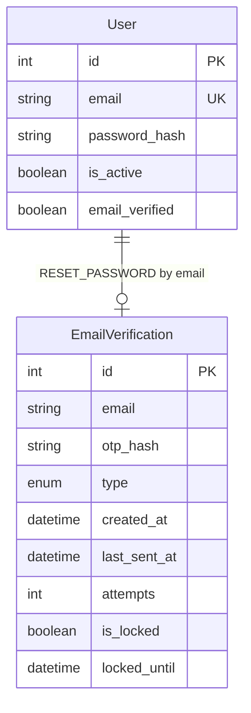

# Data Model: UC07 - Forgot Password

**Feature**: Quên Mật Khẩu (Forgot Password)  
**Date**: 2026-06-30  
**Status**: DESIGN (synced with DATABASE.md)

---

## Overview

UC07 tái sử dụng bảng `email_verifications` (shared với UC04 Register). Records có `type = 'RESET_PASSWORD'` được tạo khi user yêu cầu reset, xác thực ở bước 2, và **hard DELETE** sau khi đổi mật khẩu thành công.

**Source of truth**: `DATABASE.md` §3.1 — Table `email_verifications`

---

## Entities

### 1. EmailVerification (Shared — UC04 + UC07)

**Table**: `email_verifications`

| Field | Type | Constraints | Description |
|-------|------|-------------|-------------|
| id | INT | PRIMARY KEY, AUTO_INCREMENT | Verification ID |
| email | VARCHAR(255) | NOT NULL | Email nhận OTP (normalized: lowercase, trim) |
| otp_hash | VARCHAR(255) | NOT NULL | Bcrypt hash của OTP 6 chữ số |
| type | ENUM | NOT NULL | `REGISTER` \| `RESET_PASSWORD` |
| created_at | TIMESTAMP | DEFAULT NOW() | Thời điểm tạo OTP (TTL 10 phút) |
| last_sent_at | TIMESTAMP | NULL | Thời điểm gửi OTP lần cuối (cooldown 60s) |
| attempts | INT | DEFAULT 0 | Số lần nhập sai OTP |
| is_locked | BOOLEAN | DEFAULT FALSE | Cờ khóa sau 5 lần sai |
| locked_until | TIMESTAMP | NULL | Thời điểm hết khóa (15 phút) |

**Indexes**:

- PRIMARY KEY (`id`)
- UNIQUE (`email`, `type`)
- INDEX (`email`)
- INDEX (`created_at`)
- INDEX (`locked_until`)

**UC07 Business Rules**:

1. Một email chỉ có tối đa 1 record active cho `type = 'RESET_PASSWORD'` (enforced by UNIQUE)
2. TTL: `last_sent_at + 10 minutes > NOW()` (takes từ thời điểm gửi OTP lần cuoi)
3. Cooldown: `last_sent_at + 60 seconds > NOW()` → reject resend
4. Lockout: sau 5 lần sai → `is_locked = true`, `locked_until = NOW() + 15 min`
5. Kiểm tra `locked_until` **trước** cooldown (FR-007)
6. Tạo OTP mới: upsert record (`type = 'RESET_PASSWORD'`), reset `attempts = 0`, `is_locked = false`
7. Verify bước 2: **giữ record** (chưa DELETE) để bước 3 re-verify
8. Reset thành công: **DELETE** record WHERE `email = ? AND type = 'RESET_PASSWORD'`

**State Transitions (RESET_PASSWORD)**:

```text
[Created/Upserted] → attempts=0, is_locked=false, locked_until=null
  → [Wrong OTP x1-4] → attempts++
  → [Wrong OTP x5] → is_locked=true, locked_until=NOW()+15min
  → [Verify OK step 2] → record preserved
  → [Reset OK step 3] → DELETE record
  → [Expired] → created_at > 10min → reject verify (record may remain until cleanup)
```

---

### 2. User (Existing)

**Table**: `users`

**UC07 changes**: UPDATE `password_hash` sau OTP verify + transaction DELETE verification record.

| Field | UC07 usage |
|-------|------------|
| email | Lookup user exists (step 1); update target (step 3) |
| password_hash | Updated with bcrypt (BCRYPT_SALT_ROUNDS) |
| is_active | MUST be `true` to complete reset (403 if false) |
| email_verified | **Not checked** — user may reset before email verified |

---

## Relationships



**Note**: Không có FK từ `email_verifications.email` → `users.email` (zero enumeration: fake OTP flow không lưu DB).

---

## Prisma Schema (Target)

```prisma
enum EmailVerificationType {
  REGISTER
  RESET_PASSWORD
}

model EmailVerification {
  id           Int              @id @default(autoincrement())
  email        String           @db.VarChar(255)
  otpHash      String                 @map("otp_hash") @db.VarChar(255)
  type         EmailVerificationType  @default(REGISTER)
  createdAt    DateTime               @default(now()) @map("created_at")
  lastSentAt   DateTime?              @map("last_sent_at")
  attempts     Int              @default(0)
  isLocked     Boolean                @default(false) @map("is_locked")
  lockedUntil  DateTime?              @map("locked_until")

  @@unique([email, type])
  @@index([email])
  @@index([createdAt])
  @@index([lockedUntil])
  @@map("email_verifications")
}
```

---

## Query Patterns

### Upsert RESET_PASSWORD OTP

```javascript
await prisma.emailVerification.upsert({
  where: {
    email_type: { email, type: 'RESET_PASSWORD' }
  },
  create: {
    email,
    otp_hash: hashedOtp,
    type: 'RESET_PASSWORD',
    last_sent_at: new Date(),
    attempts: 0,
    is_locked: false,
    locked_until: null
  },
  update: {
    otp_hash: hashedOtp,
    created_at: new Date(),
    last_sent_at: new Date(),
    attempts: 0,
    is_locked: false,
    locked_until: null
  }
});
```

### Find for verify

```javascript
await prisma.emailVerification.findUnique({
  where: {
    email_type: { email, type: 'RESET_PASSWORD' }
  }
});
```

### Delete after successful reset (sequential)

```javascript
// Step 1: Update user password
await authRepository.updatePassword(email, hashedPassword);

// Step 2: Delete OTP record
await authRepository.deleteVerification(email, 'RESET_PASSWORD');
```

**Note**: Two operations called sequentially. `updatePassword` in `auth.repository.js` calls `prisma.user.update()`, `deleteVerification` calls `prisma.emailVerification.delete()`. Error handling done at service layer.
