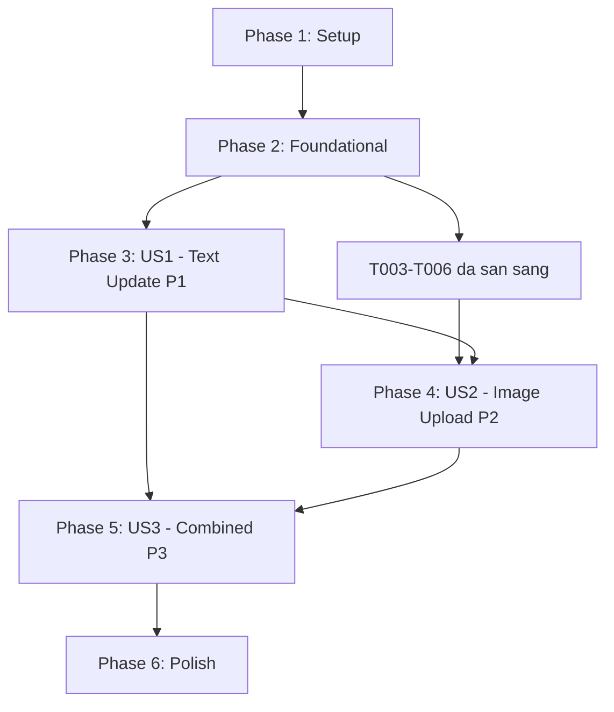

# Tasks: Cập nhật hồ sơ cơ bản (UC19 - Edit Profile)

**Input**: Tài liệu thiết kế từ `.sdd/CuongLH/UC19-feat-profile-edit/`

**Prerequisites**: plan.md (bắt buộc), spec.md (bắt buộc - chứa user stories), research.md, data-model.md, contracts/

**Tests**: Các task test bên dưới là BẮT BUỘC — phải viết test trước, để test FAIL trước khi implement.

**Organization**: Tasks được nhóm theo từng user story để mỗi story có thể được implement và test độc lập.

## Format: `[ID] [P?] [Story] Mô tả`

- **[P]**: Có thể chạy song song (khác file, không phụ thuộc lẫn nhau)
- **[Story]**: User story mà task này thuộc về (US1, US2, US3)
- Mỗi task ghi rõ đường dẫn file chính xác

## Quy ước đường dẫn

Tất cả đường dẫn đều tính từ `backend/`.

---

## Phase 1: Setup (Khởi tạo hạ tầng chung)

**Mục đích**: Khởi tạo project và cài đặt dependencies

- [ ] T001 Kiểm tra biến môi trường `CLOUDINARY_CLOUD_NAME`, `CLOUDINARY_API_KEY`, `CLOUDINARY_API_SECRET` đã có trong `backend/.env` chưa. Nếu chưa, thêm vào `.env.example` để các thành viên khác biết cần cấu hình.

- [ ] T002 [P] Cài đặt dependencies mới: chạy `npm install multer cloudinary` trong thư mục `backend/`

---

## Phase 2: Foundational (Nền tảng cốt lõi — chặn tất cả user story)

**Mục đích**: Hạ tầng cốt lõi PHẢI hoàn thành TRƯỚC KHI bắt đầu bất kỳ user story nào

**⚠️ NGUY HIỂM**: Không user story nào được bắt đầu nếu phase này chưa xong

- [ ] T003 [P] Tạo `backend/src/middlewares/upload.middleware.js` — Cấu hình Multer dùng `memoryStorage` (không ghi xuống ổ đĩa, giữ buffer trong RAM để đẩy thẳng lên Cloudinary). Thiết lập `fileFilter`: chỉ chấp nhận MIME type `image/jpeg`, `image/jpg`, `image/png`. Thiết lập `limits.fileSize = 5 * 1024 * 1024` (5MB). Export middleware dùng `.single('avatar')` (tên field trong form-data là `avatar`). Khi file không hợp lệ, throw `MulterError` với message tiếng Việt.

- [ ] T004 [P] Tạo `backend/src/services/cloudinary.service.js` — Service wrapper cho Cloudinary SDK. Ba hàm chính:
  - `uploadImage(fileBuffer)` — Nhận buffer từ Multer, gọi `cloudinary.uploader.upload_stream()`, trả về `{ public_id, secure_url }`. Bọc trong Promise.
  - `deleteImage(publicId)` — Gọi `cloudinary.uploader.destroy(publicId)`, trả về kết quả. Nếu thất bại, log warning bằng Pino (KHÔNG throw vì ảnh cũ không xóa được không ảnh hưởng nghiệp vụ chính).
  - `extractPublicId(avatarUrl)` — Helper parse `public_id` từ Cloudinary URL (pattern: `https://res.cloudinary.com/<cloud_name>/image/upload/v<version>/<public_id>.<format>`).

- [ ] T005 [P] Tạo `backend/src/middlewares/validators/profile.validator.js` — Zod schemas cho Edit Profile:
  - `updateProfileSchema` với các field: `full_name` (optional, string, min 2 ký tự, max 255), `phone_number` (optional, string, regex số điện thoại Việt Nam 10-11 chữ số bắt đầu bằng 0). Dùng `.strict()` để tự động strip các field không được định nghĩa (bảo vệ chống field injection — nếu client gửi `email`, `password`, `role_id` sẽ bị loại bỏ).
  - Export middleware `validateUpdateProfile` gọi `schema.parse(req.body)` và gán kết quả vào `req.validatedData`.

- [ ] T006 Thêm hàm `updateUser(userId, updateData)` vào `backend/src/repositories/profile.repository.js`:
  - Dùng `prisma.user.update({ where: { id: userId }, data: updateData, select: { id: true, fullName: true, email: true, phone: true, avatarUrl: true, isActive: true } })`.
  - Chỉ select các field an toàn, TUYỆT ĐỐI KHÔNG select `passwordHash`, `roleId`.
  - Trả về user đã cập nhật hoặc throw Prisma error nếu không tìm thấy.

**Checkpoint**: Nền tảng đã sẵn sàng — có thể bắt đầu implement từng user story

---

## Phase 3: User Story 1 - Cập nhật thông tin văn bản cơ bản (Priority: P1) 🎯 MVP

**Mục tiêu**: Tình nguyện viên có thể cập nhật `full_name` và/hoặc `phone_number` qua `PATCH /api/v1/user/me`

**Cách test độc lập**: Đăng nhập bằng tài khoản volunteer → Gửi PATCH với `{"full_name": "Tên Mới"}` → GET /me xác nhận tên đã đổi; Gửi PATCH với `{"phone_number": "0987654321"}` → xác nhận SĐT đã đổi; Gửi PATCH với body rỗng → xác nhận không có gì thay đổi; Gửi PATCH với SĐT sai định dạng ("123") → nhận lỗi 400

### Tests cho User Story 1 ⚠️

> **LƯU Ý: Viết test TRƯỚC, đảm bảo chúng FAIL trước khi implement**

- [ ] T007 [P] [US1] Unit test cho `profile.validator.js` — `updateProfileSchema` trong `backend/tests/unit/profile.validator.test.js`: test `full_name` hợp lệ (≥2 ký tự), `full_name` quá ngắn (<2 ký tự), `phone_number` hợp lệ (10-11 chữ số, bắt đầu bằng 0), `phone_number` sai định dạng, field lạ (`email`, `password`) bị strip, body rỗng vẫn pass (tất cả field đều optional)

- [ ] T008 [P] [US1] Unit test cho `ProfileService.updateProfile()` — text-only update trong `backend/tests/unit/profile.service.test.js`: mock repository, test cập nhật chỉ `full_name`, test cập nhật chỉ `phone_number`, test cập nhật cả hai, test mapping `phone_number` → `phone`, test user không tồn tại (throw `USER_NOT_FOUND`), test user bị vô hiệu hóa (throw `ACCOUNT_DISABLED`)

- [ ] T009 [P] [US1] Integration test cho `PATCH /api/v1/user/me` — text update trong `backend/tests/integration/profile.test.js`: test cập nhật `full_name` thành công (200), test cập nhật `phone_number` thành công (200), test cập nhật cả hai thành công (200), test body rỗng thành công (200 - không thay đổi), test `full_name` quá ngắn → 400, test `phone_number` sai định dạng → 400, test không có token → 401, test field lạ bị bỏ qua

### Implementation cho User Story 1

- [ ] T010 [US1] Implement hàm `updateProfile(userId, updateData, file)` trong `backend/src/services/profile.service.js`:
  - Validate `updateData` bằng `updateProfileSchema` (Zod).
  - Nếu validation fail → throw `ServiceError` với status 400, code `VALIDATION_ERROR`.
  - Gọi `profileRepository.findUserWithSkills(userId)` để kiểm tra user tồn tại.
  - Nếu không tìm thấy → throw `USER_NOT_FOUND` (404).
  - Nếu `isActive === false` → throw `ACCOUNT_DISABLED` (403).
  - Map `phone_number` → `phone` trước khi gọi repository.
  - Gọi `profileRepository.updateUser(userId, finalUpdateData)`.
  - Trả về profile đã cập nhật (format giống `getUserProfile`: `full_name`, `email`, `phone_number`, `avatar_url`, `skills`).
  - Nếu `file === undefined` (US1 chưa dùng file) → bỏ qua hoàn toàn, chỉ xử lý text.

- [ ] T011 [US1] Implement hàm `updateMyProfile(req, res)` trong `backend/src/controllers/profile.controller.js`:
  - Lấy `user_id` từ `req.user.user_id` (do `authMiddleware` inject — TUYỆT ĐỐI KHÔNG lấy từ `req.body.userId`).
  - Gọi `updateProfile(userId, req.body, req.file)`.
  - Nếu thành công → `res.status(200).json(successResponse(data, "Cập nhật hồ sơ thành công"))`.
  - Nếu lỗi `ServiceError` → map `error.status` và `error.code` vào `errorResponse`.
  - Bọc toàn bộ trong try-catch.

- [ ] T012 [US1] Thêm route `PATCH /me` trong `backend/src/routes/user.routes.js`:
  - Chain `authMiddleware` (xác thực JWT, inject `req.user`).
  - Chain controller `updateMyProfile`.
  - Chưa cần Multer middleware (US1 chỉ xử lý text JSON).

**Checkpoint**: User Story 1 hoàn chỉnh — text update hoạt động độc lập, có thể demo MVP

---

## Phase 4: User Story 2 - Cập nhật ảnh đại diện (Priority: P2)

**Mục tiêu**: Tình nguyện viên có thể upload ảnh đại diện mới qua `PATCH /api/v1/user/me` với `multipart/form-data`. Ảnh cũ được xóa khỏi Cloudinary.

**Cơ chế xóa ảnh cũ**: Service đọc `avatar_url` hiện tại từ DB → extract `public_id` từ Cloudinary URL → gọi `cloudinary.uploader.destroy(public_id)` → nếu thất bại chỉ log warning (ảnh mồ côi chấp nhận được trong v1). Sau đó upload ảnh mới, lưu URL mới vào DB.

**Cách test độc lập**: Đăng nhập → Upload file `.jpg` 2MB → xác nhận `avatar_url` cập nhật; Upload file `.gif` → xác nhận lỗi 400; Upload file 6MB → xác nhận lỗi 413; Upload ảnh mới khi đã có ảnh cũ → xác nhận ảnh cũ bị xóa khỏi Cloudinary

### Tests cho User Story 2 ⚠️

- [ ] T013 [P] [US2] Unit test cho `cloudinary.service.js` trong `backend/tests/unit/cloudinary.service.test.js`: mock `cloudinary.uploader`, test `uploadImage(buffer)` thành công trả về `{ public_id, secure_url }`, test `uploadImage(buffer)` thất bại throw lỗi, test `deleteImage(publicId)` thành công, test `deleteImage(publicId)` thất bại (vẫn không throw), test `extractPublicId(url)` parse đúng Cloudinary URL pattern

- [ ] T014 [P] [US2] Unit test cho `upload.middleware.js` trong `backend/tests/unit/upload.middleware.test.js`: test file `.jpg` pass qua filter, test file `.png` pass qua filter, test file `.gif` bị reject với lỗi "Chỉ hỗ trợ định dạng jpg, jpeg, png", test file `.bmp` bị reject, test file 6MB bị reject với `MulterError: LIMIT_FILE_SIZE`, test không có file upload → vẫn pass (avatar optional)

- [ ] T015 [US2] Unit test cho `ProfileService.updateProfile()` — image upload trong `backend/tests/unit/profile.service.test.js`: mock cloudinary service + repository, test upload avatar mới khi user chưa có avatar cũ (không gọi `deleteImage`), test upload avatar mới khi user đã có avatar cũ (gọi `deleteImage` với `public_id` cũ trước), test Cloudinary upload thất bại → DB không bị update, test Cloudinary delete thất bại → vẫn upload ảnh mới và update DB bình thường

- [ ] T016 [US2] Integration test cho image upload trong `backend/tests/integration/profile.test.js`: test upload ảnh `.jpg` hợp lệ → 200 và `avatar_url` mới, test upload ảnh `.png` hợp lệ → 200, test upload file `.gif` → 400, test upload file 6MB → 413, test upload không có token → 401

### Implementation cho User Story 2

- [ ] T017 [US2] Cập nhật hàm `updateProfile()` trong `backend/src/services/profile.service.js` để xử lý tham số `file`:
  - Nếu `file` tồn tại:
    1. Lấy `currentUser` (bao gồm `avatarUrl`) từ repository.
    2. Nếu `currentUser.avatarUrl` có giá trị → gọi `cloudinaryService.extractPublicId(avatarUrl)` để lấy `public_id` → gọi `cloudinaryService.deleteImage(publicId)`. Nếu delete fail → log warning bằng Pino, KHÔNG throw.
    3. Gọi `cloudinaryService.uploadImage(file.buffer)` để upload ảnh mới.
    4. Nếu upload fail → throw `ServiceError(500, "CLOUDINARY_ERROR")`, KHÔNG update DB.
    5. Nếu upload thành công → thêm `avatarUrl: result.secure_url` vào `finalUpdateData`.
  - Nếu `file` không tồn tại → chỉ xử lý text (giữ nguyên logic US1).

- [ ] T018 [US2] Cập nhật hàm `updateMyProfile()` trong `backend/src/controllers/profile.controller.js`:
  - Nhận `req.file` từ Multer (đã được parse trước đó bởi `uploadMiddleware`).
  - Gọi `updateProfile(userId, req.body, req.file)`.
  - Xử lý MulterError: nếu `err.code === 'LIMIT_FILE_SIZE'` → 413 với message "Dung lượng file vượt quá giới hạn 5MB".
  - Xử lý lỗi file filter: nếu Multer reject do sai định dạng → 400 với message "Chỉ hỗ trợ định dạng jpg, jpeg, png".

- [ ] T019 [US2] Cập nhật route `PATCH /me` trong `backend/src/routes/user.routes.js`:
  - Chèn `uploadMiddleware` vào chain, **TRƯỚC** `authMiddleware`.
  - Lý do: Multer cần parse `multipart/form-data` trước khi `authMiddleware` đọc cookies từ request.
  - Chain: `router.patch('/me', uploadMiddleware, authMiddleware, updateMyProfile)`.

**Checkpoint**: User Story 2 hoàn chỉnh — image upload hoạt động độc lập, tương thích với US1

---

## Phase 5: User Story 3 - Cập nhật kết hợp văn bản và ảnh (Priority: P3)

**Mục tiêu**: Tình nguyện viên có thể cập nhật đồng thời `full_name` + `phone_number` + `avatar` trong cùng một request. Toàn bộ request phải atomic — nếu bất kỳ phần nào fail, không có gì được update.

**Cách test độc lập**: Đăng nhập → Gửi PATCH `multipart/form-data` với cả 3 field → xác nhận tất cả đều được cập nhật; Gửi PATCH với text hợp lệ + ảnh không hợp lệ → xác nhận rollback (không có partial update); Gửi PATCH với text không hợp lệ + ảnh hợp lệ → xác nhận text validation chạy trước, ảnh không bị upload lãng phí

### Tests cho User Story 3 ⚠️

- [ ] T020 [P] [US3] Unit test cho combined update trong `backend/tests/unit/profile.service.test.js`: test cập nhật `full_name` + `phone_number` + `avatar` đồng thời → tất cả thành công, test Cloudinary upload thất bại → DB không đổi, rollback hoàn toàn, test text validation thất bại (phone_number sai) → ảnh KHÔNG được upload (validate text trước khi gọi Cloudinary), test Cloudinary delete ảnh cũ thất bại → ảnh mới vẫn upload, DB vẫn update bình thường

- [ ] T021 [P] [US3] Integration test cho combined update trong `backend/tests/integration/profile.test.js`: test gửi cả `full_name` + `phone_number` + `avatar` trong 1 request → 200 và tất cả field mới, test gửi text + ảnh >5MB → toàn bộ bị từ chối (413), test gửi text sai + ảnh hợp lệ → 400 (validate text trước, ảnh không được xử lý)

### Implementation cho User Story 3

- [ ] T022 [US3] Rà soát và củng cố transaction integrity trong `updateProfile()` (`backend/src/services/profile.service.js`):
  - Thứ tự xử lý STRICT: **(1)** Validate text bằng Zod trước → nếu fail return 400 ngay (tiết kiệm Cloudinary API call). **(2)** Nếu có file → xử lý upload Cloudinary. **(3)** Nếu upload Cloudinary fail → throw lỗi, KHÔNG gọi DB. **(4)** Nếu upload thành công → gọi `profileRepository.updateUser()` để update DB. **(5)** Nếu DB update fail sau khi đã upload ảnh → gọi `cloudinaryService.deleteImage(public_id_mới)` để dọn ảnh vừa upload (tránh ảnh mồ côi).
  - Kết quả: transaction không strict (không dùng Prisma `$transaction` vì có external API call Cloudinary bên ngoài), nhưng đảm bảo rollback thủ công qua các bước bù trừ.

- [ ] T023 [US3] Rà soát toàn bộ error handling trong `backend/src/controllers/profile.controller.js`:
  - Đảm bảo tất cả trường hợp lỗi đều có message tiếng Việt rõ ràng.
  - Map lỗi: `VALIDATION_ERROR` → 400, `UNAUTHORIZED` → 401, `USER_NOT_FOUND` → 404, `CLOUDINARY_ERROR` → 500, `INTERNAL_SERVER_ERROR` → 500, `LIMIT_FILE_SIZE` → 413.
  - Đảm bảo không leak stack trace trong production (chỉ hiển thị `error.message`, không hiển thị `error.stack`).

**Checkpoint**: Cả 3 user story hoàn chỉnh — kết hợp text + ảnh an toàn với transaction integrity

---

## Phase 6: Polish & Hoàn thiện

**Mục đích**: Tài liệu, logging, validation cuối cùng trước khi merge

- [ ] T024 [P] Viết Swagger JSDoc cho `PATCH /api/v1/user/me` trong `backend/src/routes/user.routes.js` (CHỈ trong file routes, tuân thủ Lesson 5 - CLAUDE.md):
  - Document cả 2 content-type: `application/json` (text update) và `multipart/form-data` (image upload).
  - Request body: `full_name` (string, optional), `phone_number` (string, optional), `avatar` (file, optional).
  - Tất cả response codes: 200 (kèm example response), 400 (`VALIDATION_ERROR` + `LIMIT_FILE_SIZE`), 401 (`UNAUTHORIZED`), 413 (payload too large), 500 (`CLOUDINARY_ERROR`, `INTERNAL_SERVER_ERROR`).
  - Nội dung khớp với `contracts/api-contract.md`.

- [ ] T025 [P] Thêm Pino logger trong `backend/src/services/profile.service.js`:
  - Log `info` khi update profile thành công: `{ userId, changedFields: ['full_name', 'phone_number'] }`.
  - Log `warn` khi Cloudinary delete ảnh cũ thất bại: `{ userId, oldPublicId, error: error.message }`.
  - Log `error` khi Cloudinary upload thất bại: `{ userId, error: error.message }`.
  - KHÔNG log nội dung dữ liệu cá nhân (giá trị của full_name, phone_number).

- [ ] T026 Chạy toàn bộ test suite: `npm test` trong `backend/`:
  - Tất cả unit test pass (T007, T008, T013, T014, T015, T020).
  - Tất cả integration test pass (T009, T016, T021).
  - Coverage cho `profile.service.js` đạt ≥ 80%.
  - Nếu test fail → sửa code, TUYỆT ĐỐI KHÔNG sửa test để pass.

- [ ] T027 Chạy xác thực theo `quickstart.md`:
  - Chạy từng curl example, xác minh response khớp `api-contract.md`.
  - Test PATCH với JSON body (text only) → 200.
  - Test PATCH với `multipart/form-data` (image) → 200.
  - Test PATCH với invalid data → 400.

- [ ] T028 Kiểm tra code review checklist:
  - Không có `console.log` trong production code (chỉ dùng Pino logger).
  - Không có comment `TODO` hoặc `FIXME`.
  - Không có business logic trong controller (chỉ gọi service).
  - Không hardcode secrets (tất cả qua `process.env`).
  - TUYỆT ĐỐI KHÔNG dùng `req.body.userId` (chỉ `req.user.user_id` từ JWT).
  - Response luôn dùng `successResponse()` / `errorResponse()` từ `response.util.js`.
  - Các field không hợp lệ bị strip (không cho update `email`, `password`, `role_id`).
  - Swagger JSDoc CHỈ nằm trong `routes/` (tuân thủ Lesson 5 - CLAUDE.md).

---

## Sơ đồ phụ thuộc và thứ tự thực hiện

### Phụ thuộc giữa các Phase

### Phụ thuộc giữa các User Story

- **US1 (P1)**: Có thể bắt đầu sau Phase 2 — KHÔNG phụ thuộc US2 hay US3
- **US2 (P2)**: Cần Phase 2 + cấu trúc controller/route của US1 (T011-T012) để mở rộng
- **US3 (P3)**: Cần US1 (T010) + US2 (T017) — củng cố logic đã có, không viết mới hoàn toàn

### Trong mỗi User Story

- Test PHẢI được viết TRƯỚC và FAIL trước khi implement
- Repository → Service → Controller → Route
- Core implementation → Integration test
- Story hoàn chỉnh trước khi chuyển sang story tiếp theo

### Cơ hội chạy song song

- T003, T004, T005 (3 file khác nhau, độc lập) — chạy song song
- T007, T008, T009 (3 file test khác nhau) — chạy song song
- T013, T014 (2 file test khác nhau) — chạy song song
- T020, T021 (2 file test khác nhau) — chạy song song
- T024, T025 (Swagger + Logging — khác file) — chạy song song

---

## Chiến lược implement

### MVP Trước (Chỉ User Story 1)

1. Hoàn thành Phase 1: Setup
2. Hoàn thành Phase 2: Foundational (QUAN TRỌNG — chặn tất cả story)
3. Hoàn thành Phase 3: User Story 1
4. **DỪNG và KIỂM TRA**: Test US1 độc lập với curl
5. Có thể deploy/demo ngay

### Giao hàng tăng dần

1. Setup + Foundational → Nền tảng sẵn sàng
2. Thêm US1 → Test độc lập → MVP (cập nhật text!)
3. Thêm US2 → Test độc lập → Hỗ trợ upload ảnh
4. Thêm US3 → Test độc lập → Kết hợp text + ảnh, an toàn transaction
5. Polish → Swagger + Logging → Sẵn sàng production

### Chiến lược làm song song (nếu có 2 người)

1. Cả hai cùng hoàn thành Setup + Foundational
2. Người A: US1 (test → repo → service → controller → route)
3. Người B: US2 (test cloudinary + multer → service update → route update) — sau khi US1 có cấu trúc service/controller/route
4. Cả hai: US3 (củng cố transaction) + Polish

---

## Ghi chú

- `[P]` = task chạy song song được (khác file, không phụ thuộc)
- `[Story]` = gắn task vào user story cụ thể để dễ trace
- Mỗi user story phải hoàn chỉnh và test được độc lập
- **Test phải FAIL để fix trước implement**
- Commit sau mỗi task hoặc nhóm task logic
- Dừng ở mỗi checkpoint để validate story độc lập
- Tránh: task mơ hồ, conflict cùng file, phụ thuộc chéo giữa các story
- `req.user.user_id` từ JWT (`authMiddleware`), TUYỆT ĐỐI KHÔNG `req.body.userId` (Lesson 3 — Anti-IDOR)
- `phone_number` từ API request map sang `phone` trong DB (field mapping — `data-model.md`)
- Multer middleware phải đứng TRƯỚC `authMiddleware` trong route (parse `multipart/form-data` trước khi đọc cookie)
- Cloudinary `public_id` được extract từ URL pattern: `https://res.cloudinary.com/<cloud_name>/image/upload/v<version>/<public_id>.<format>`
- Ảnh mồ côi trên Cloudinary (orphaned images) do delete fail được coi là acceptable — log warning để admin dọn thủ công
- Database table `users` đã có field `avatar_url` (VARCHAR 500, nullable) — KHÔNG cần migration mới
- Swagger JSDoc CHỈ được viết trong `backend/src/routes/` — TUYỆT ĐỐI KHÔNG viết Swagger trong controllers hay services (Lesson 5 - CLAUDE.md)
