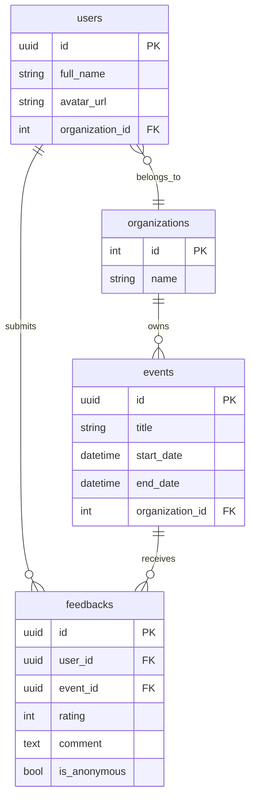

# Data Model: View Feedback Detail (UC50)

**Feature**: View Feedback Detail  
**Date**: 2026-07-01  
**Status**: Phase 1 Design

---

## Overview

UC50 là READ-ONLY feature, không tạo hoặc sửa dữ liệu. Reuse hoàn toàn schema từ UC48 (Submit Feedback) và UC49 (View Feedback List). Feature chỉ đọc dữ liệu từ 4 tables: `feedbacks`, `users`, `events`, `organizations`.

---

## Entities

### 1. Feedback (Primary Entity)

**Table**: `feedbacks`  
**Owner**: Member 2 (NamLD - submit), Member 3 (TienTD - view)  
**Purpose**: Lưu trữ phản hồi từ volunteers sau sự kiện

```typescript
interface Feedback {
  id: string;                    // UUID, PRIMARY KEY
  application_id: string;        // UUID, UNIQUE, FK → applications.id
  user_id: string;               // UUID, FK → users.id
  event_id: string;              // UUID, FK → events.id
  rating: number | null;         // Integer 1-5, nullable
  comment: string;               // TEXT, NOT NULL
  is_anonymous: boolean;         // Boolean, default false
  status: 'DRAFT' | 'SUBMITTED'; // Enum, default 'SUBMITTED'
  created_at: Date;              // Timestamp
  updated_at: Date;              // Timestamp
}
```

**Business Rules** (from DATABASE.md):
- UNIQUE constraint on `application_id`: 1 volunteer chỉ có 1 feedback per event
- `comment` MUST NOT be empty
- Immutable: Sau khi `status = 'SUBMITTED'`, KHÔNG được UPDATE rating/comment
- Soft delete: Feature checks `is_active = true` (inherited from applications)

**UC50 Usage**: READ-ONLY
- Query by `id` với organization-based filter
- Include relations: `user`, `event`
- Return full `comment` (no truncation như UC49)

---

### 2. User (Volunteer Profile)

**Table**: `users`  
**Owner**: Member 1 (CuongLH)  
**Purpose**: Thông tin người dùng (volunteer gửi feedback)

```typescript
interface User {
  id: string;            // UUID, PRIMARY KEY
  email: string;         // VARCHAR(255), UNIQUE
  full_name: string;     // VARCHAR(255)
  phone: string | null;  // VARCHAR(20)
  avatar_url: string | null; // VARCHAR(500), Cloudinary URL
  role_id: number;       // INT, FK → roles.id
  is_active: boolean;    // Boolean, soft delete flag
  // ... other fields excluded for UC50
}
```

**PUBLIC_PROFILE_SELECT** (Security Pattern):
```typescript
// UC50 chỉ select những field này:
{
  id: true,
  full_name: true,
  avatar_url: true
  // EXCLUDED: email, phone, password_hash, role_id
}
```

**UC50 Usage**: READ-ONLY
- Join via `feedback.user_id`
- Return public profile ONLY (no PII)
- Handle anonymous: Return `null` if `feedback.is_anonymous = true`

---

### 3. Event (Context Info)

**Table**: `events`  
**Owner**: Member 3 (TienTD)  
**Purpose**: Thông tin sự kiện liên quan đến feedback

```typescript
interface Event {
  id: string;              // UUID, PRIMARY KEY
  title: string;           // VARCHAR(500)
  description: string;     // TEXT
  location: string;        // VARCHAR(500)
  start_date: Date;        // DATETIME
  end_date: Date;          // DATETIME
  organization_id: number; // INT, FK → organizations.id
  status: EventStatus;     // Enum
  is_active: boolean;      // Boolean, soft delete flag
  // ... other fields excluded for UC50
}
```

**UC50 SELECT** (Minimal fields):
```typescript
{
  id: true,
  title: true,
  start_date: true,
  end_date: true,
  organization_id: true  // For authorization check
}
```

**UC50 Usage**: READ-ONLY
- Join via `feedback.event_id`
- Use `organization_id` for authorization check
- Display title + dates để Staff có context

---

### 4. Organization (Authorization)

**Table**: `organizations`  
**Owner**: Member 5 (DucNM)  
**Purpose**: Tổ chức chủ quản sự kiện (for access control)

```typescript
interface Organization {
  id: number;          // INT, PRIMARY KEY
  name: string;        // VARCHAR(255)
  is_active: boolean;  // Boolean, soft delete flag
  // ... other fields not needed for UC50
}
```

**UC50 Usage**: IMPLICIT (not in SELECT, used for WHERE clause)
- Staff's `organization_id` extracted from JWT token
- Filter: `event.organization_id = staff.organization_id`
- Ensures Staff chỉ xem feedbacks từ sự kiện của org mình

---

## Relationships



**Relationship Constraints**:
- `feedbacks.user_id` → `users.id` (many-to-one)
- `feedbacks.event_id` → `events.id` (many-to-one)
- `events.organization_id` → `organizations.id` (many-to-one)
- `users.organization_id` → `organizations.id` (many-to-one, for Staff users)

**Join Pattern for UC50**:
```sql
SELECT f.*, u.full_name, u.avatar_url, e.title, e.start_date, e.end_date
FROM feedbacks f
INNER JOIN users u ON f.user_id = u.id
INNER JOIN events e ON f.event_id = e.id
WHERE f.id = :feedbackId
  AND e.organization_id = :staffOrganizationId
  AND f.is_active = true;
```

---

## State Transitions

**N/A** - UC50 là READ-ONLY feature, không thay đổi trạng thái.

Feedback state machine (for reference từ UC48):
```
NULL → DRAFT → SUBMITTED (immutable)
```

UC50 chỉ đọc feedbacks có `status = 'SUBMITTED'`.

---

## Validation Rules

### Input Validation (Request Layer)

**feedbackId Parameter**:
```typescript
// Zod schema
z.object({
  params: z.object({
    id: z.string().uuid({ message: 'Invalid feedback ID format' })
  })
})
```

**Validation Rules**:
- MUST be valid UUID v4 format
- MUST NOT be empty
- MUST NOT contain SQL injection characters (handled by Prisma)

---

### Business Validation (Service Layer)

**Authorization Rules** (FR-001 from spec):
```typescript
// Check 1: Staff role
if (!['STAFF', 'MANAGER', 'ADMIN'].includes(user.role)) {
  throw ForbiddenError('STAFF role required');
}

// Check 2: Organization ownership
const feedback = await feedbackRepository.getById(feedbackId);
if (!feedback) {
  throw NotFoundError('Feedback not found');
}

const event = await eventRepository.getById(feedback.event_id);
const staff = await userRepository.getById(staffId);

if (event.organization_id !== staff.organization_id) {
  throw ForbiddenError('Access denied - different organization');
}
```

**Data Integrity Rules**:
- Feedback MUST have `is_active = true` (not soft-deleted)
- Event MUST have `is_active = true`
- User MUST have `is_active = true`

---

### Anonymous Handling (FR-005)

**Rule**: If `feedback.is_anonymous = true`, hide volunteer PII

```typescript
// Service layer transformation
if (feedback.is_anonymous) {
  return {
    ...feedback,
    volunteer: null  // Hide user info completely
  };
} else {
  return {
    ...feedback,
    volunteer: {
      id: feedback.user.id,
      full_name: feedback.user.full_name,
      avatar_url: feedback.user.avatar_url
    }
  };
}
```

---

## Query Patterns

### Primary Query (Service Layer)

```typescript
// feedback.repository.js
async getById(feedbackId, staffOrganizationId) {
  return await prisma.feedback.findFirst({
    where: {
      id: feedbackId,
      is_active: true,
      event: {
        organization_id: staffOrganizationId,
        is_active: true
      }
    },
    include: {
      user: {
        select: {
          id: true,
          full_name: true,
          avatar_url: true
        }
      },
      event: {
        select: {
          id: true,
          title: true,
          start_date: true,
          end_date: true,
          organization_id: true
        }
      }
    }
  });
}
```

**Performance**:
- Single query với JOINs (no N+1 problem)
- Uses indexes: `feedbacks.id` (PK), `events.organization_id` (indexed)
- Expected execution time: < 100ms

---

### Authorization Query (Extracted from JWT)

```typescript
// No separate query needed
// Staff's organization_id comes from JWT token:
const staffOrganizationId = req.user.organization_id;
```

---

## Data Transformations

### Repository → Service

**Repository Output** (raw Prisma result):
```typescript
{
  id: "f7b3c1a0-...",
  rating: 5,
  comment: "Great event!\nVery organized.",
  is_anonymous: false,
  created_at: Date,
  user: {
    id: "u8a4d2b1-...",
    full_name: "Nguyễn Văn A",
    avatar_url: "https://..."
  },
  event: {
    id: "e9c5e3d2-...",
    title: "Community Beach Cleanup 2026",
    start_date: Date,
    end_date: Date
  }
}
```

**Service Output** (transformed for API):
```typescript
{
  id: "f7b3c1a0-...",
  rating: 5,
  comment: "Great event!\nVery organized.",
  is_anonymous: false,
  created_at: "2026-06-20T15:30:00Z",  // ISO 8601 format
  volunteer: {  // Renamed from 'user'
    id: "u8a4d2b1-...",
    full_name: "Nguyễn Văn A",
    avatar_url: "https://..."
  },
  event: {
    id: "e9c5e3d2-...",
    title: "Community Beach Cleanup 2026",
    start_date: "2026-06-15T08:00:00Z",
    end_date: "2026-06-15T17:00:00Z"
  },
  images: []  // Empty array for MVP (no images in UC48)
}
```

---

### Service → Controller (API Response)

**Controller Output** (ADR-006 format):
```typescript
{
  success: true,
  data: {
    feedback: {
      // ... service output above
    }
  }
}
```

---

## Security Considerations

### PII Protection

**MUST NOT expose**:
- User email
- User phone
- User password_hash
- User address (if added later)

**Anonymous Feedback**:
- Set `volunteer: null` in response
- Do NOT return `user_id` for anonymous feedbacks

---

### SQL Injection Prevention

**Protection Layers**:
1. Zod validation: Ensures UUID format before query
2. Prisma ORM: Parameterized queries automatically
3. No raw SQL: All queries via Prisma client

---

### Cross-Organization Data Leak

**Prevention**:
```typescript
// Repository layer enforces organization filter
where: {
  id: feedbackId,
  event: {
    organization_id: staffOrganizationId  // Critical filter
  }
}
```

**Test Case** (Integration test):
```typescript
// Scenario: Staff A (Org 1) tries to view Feedback from Org 2 event
const response = await request(app)
  .get(`/api/v1/feedbacks/${org2FeedbackId}`)
  .set('Cookie', org1StaffToken);

expect(response.status).toBe(404);  // Not 403, to avoid info leak
```

---

## Performance Optimization

### Database Indexes (Existing)

**Used by UC50**:
- `feedbacks.id` (PRIMARY KEY) - Fast lookup
- `events.organization_id` (INDEX) - Fast filter
- `feedbacks.user_id` (INDEX) - Fast JOIN
- `feedbacks.event_id` (INDEX) - Fast JOIN

**No New Indexes Required**: All queries use existing indexes.

---

### Query Optimization

**Single Query Strategy**:
- ✅ One DB roundtrip (vs 3 separate queries)
- ✅ Consistent data (single transaction)
- ✅ Reduced network latency

**Prisma Select Optimization**:
- Only select needed fields (not full `users.*`)
- Reduces payload size
- Faster serialization

---

## Migration Plan

**Migration Required**: ❌ NO

UC50 reuses existing schema from UC48/UC49. No database changes needed.

---

## Testing Data Requirements

### Seed Data for Tests

**Minimum Test Data**:
```typescript
// 1 Organization
{ id: 1, name: "Org A" }

// 2 Staff users (different orgs)
{ id: "staff-a", organization_id: 1, role: "STAFF" }
{ id: "staff-b", organization_id: 2, role: "STAFF" }

// 2 Events (different orgs)
{ id: "event-a", organization_id: 1 }
{ id: "event-b", organization_id: 2 }

// 3 Feedbacks
{ id: "feedback-1", event_id: "event-a", is_anonymous: false }
{ id: "feedback-2", event_id: "event-a", is_anonymous: true }
{ id: "feedback-3", event_id: "event-b", is_anonymous: false }
```

**Test Scenarios**:
1. Staff A views feedback-1 → 200 OK
2. Staff A views feedback-2 (anonymous) → 200 OK, volunteer = null
3. Staff A views feedback-3 (Org B) → 404 Not Found
4. Invalid UUID → 400 Bad Request
5. VOLUNTEER role → 403 Forbidden

---

## Summary

**Data Model Characteristics**:
- ✅ Zero new tables or migrations
- ✅ Reuses UC48/UC49 schema 100%
- ✅ Single JOIN query for performance
- ✅ Organization-based authorization at Repository level
- ✅ PII protection via PUBLIC_PROFILE_SELECT
- ✅ Anonymous feedback support built-in

**Key Takeaway**: UC50 là pure READ operation, không ảnh hưởng data integrity. All business rules enforced at Service layer, không trust client input.

---

**Last Updated**: 2026-07-01  
**Owner**: Member 3 - TienTD
