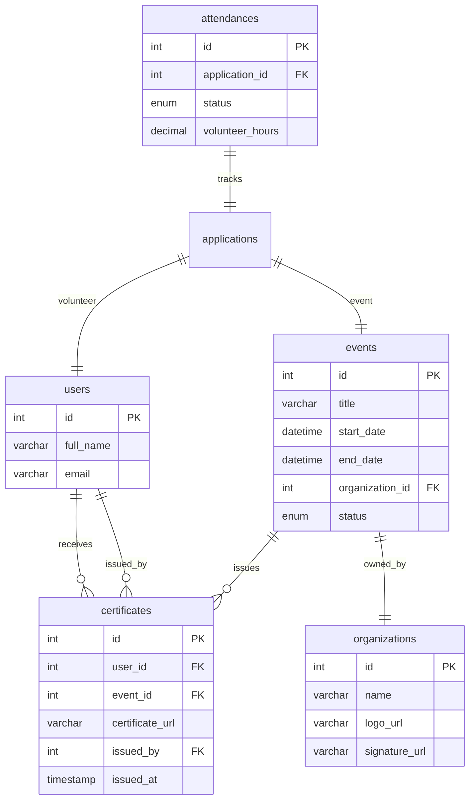

# Data Model: Generate Certificate (UC53)

**Feature**: Generate Certificate  
**Date**: 2026-07-01  
**Status**: Phase 1 Design

---

## Overview

UC53 là certificate generation feature, tạo PDF certificates hàng loạt cho volunteers đã attend events. Feature KHÔNG tạo tables mới, reuse hoàn toàn schema từ DATABASE.md. Primary entities: `certificates`, `attendances`, `events`, `users`, `organizations`.

---

## Entities

### 1. Certificate (Primary Entity)

**Table**: `certificates`  
**Owner**: Member 3 (TienTD)  
**Purpose**: Lưu thông tin chứng nhận đã cấp

```typescript
interface Certificate {
  id: number;                    // INT, PRIMARY KEY, AUTO_INCREMENT
  user_id: number;               // INT, FK → users.id
  event_id: number;              // INT, FK → events.id
  certificate_url: string;       // VARCHAR(500), Cloudinary URL
  issued_by: number;             // INT, FK → users.id (Staff)
  issued_at: Date;               // TIMESTAMP, DEFAULT CURRENT_TIMESTAMP
}
```

**Business Rules** (from DATABASE.md):
- UNIQUE constraint: `(user_id, event_id)` — 1 volunteer tối đa 1 certificate/event
- Immutable: KHÔNG được UPDATE certificate_url sau khi issued
- Chỉ tạo certificate cho volunteers có attendance.status = 'PRESENT'
- certificate_url MUST exist trên Cloudinary trước khi volunteer download

**UC53 Usage**: INSERT new records during batch generation

**Indexes**:
- PRIMARY KEY (id)
- UNIQUE (user_id, event_id) — Prevents duplicates (FR-003)
- INDEX (user_id) — Fast lookup for volunteer history
- INDEX (event_id) — Fast lookup for event certificates
- INDEX (issued_by) — Audit trail

---

### 2. Attendance (Eligibility Source)

**Table**: `attendances`  
**Owner**: Member 3 (TienTD)  
**Purpose**: Xác định volunteers eligible cho certificate

```typescript
interface Attendance {
  id: number;                    // INT, PRIMARY KEY
  application_id: number;        // INT, UNIQUE, FK → applications.id
  status: 'PRESENT' | 'ABSENT';  // ENUM
  volunteer_hours: number | null;// DECIMAL(5,2), nullable
  checked_in_by: number;         // INT, FK → users.id (Staff)
  checked_in_at: Date;           // TIMESTAMP
  notes: string | null;          // TEXT, nullable
}
```

**UC53 Usage**: READ-ONLY
- Query: `WHERE status = 'PRESENT'` để lấy eligible volunteers
- Include: `application.user`, `application.event` via JOIN

**Eligibility Rule** (FR-002):
```sql
SELECT u.id, u.full_name, a.volunteer_hours
FROM attendances att
JOIN applications app ON att.application_id = app.id
JOIN users u ON app.user_id = u.id
WHERE app.event_id = :eventId
  AND att.status = 'PRESENT'
  AND app.status = 'APPROVED'
  AND u.is_active = TRUE;
```

---

### 3. Event (Context Data)

**Table**: `events`  
**Owner**: Member 3 (TienTD)  
**Purpose**: Thông tin sự kiện cho certificate template

```typescript
interface Event {
  id: number;                    // INT, PRIMARY KEY
  title: string;                 // VARCHAR(500)
  description: string;           // TEXT
  location: string;              // VARCHAR(500)
  start_date: Date;              // DATETIME
  end_date: Date;                // DATETIME
  organization_id: number;       // INT, FK → organizations.id
  status: EventStatus;           // ENUM
  is_active: boolean;            // BOOLEAN
  // ... other fields
}
```

**UC53 SELECT** (Minimal fields):
```typescript
{
  id: true,
  title: true,
  start_date: true,
  end_date: true,
  organization_id: true,
  status: true
}
```

**UC53 Usage**: READ-ONLY
- Validate: `status = 'COMPLETED'` (FR-001)
- Template data: event title, dates
- Authorization: `organization_id` for Staff ownership check

---

### 4. User (Volunteer & Staff Info)

**Table**: `users`  
**Owner**: Member 1 (CuongLH)  
**Purpose**: Volunteer info cho certificate + Staff issuer

```typescript
interface User {
  id: number;                    // INT, PRIMARY KEY
  email: string;                 // VARCHAR(255), UNIQUE
  full_name: string;             // VARCHAR(255)
  phone: string | null;          // VARCHAR(20)
  avatar_url: string | null;     // VARCHAR(500)
  role_id: number;               // INT, FK → roles.id
  is_active: boolean;            // BOOLEAN
  // ... other fields excluded
}
```

**CERTIFICATE_SELECT** (for PDF template):
```typescript
{
  id: true,
  full_name: true,
  email: true  // For email notification (UC66)
}
```

**UC53 Usage**: READ-ONLY
- Volunteer: full_name for certificate
- Staff: issued_by reference
- Email: trigger UC66 notification

---

### 5. Organization (Logo & Signature)

**Table**: `organizations`  
**Owner**: Member 5 (DucNM)  
**Purpose**: Organization logo và signature cho certificate template

```typescript
interface Organization {
  id: number;                    // INT, PRIMARY KEY
  name: string;                  // VARCHAR(255)
  logo_url: string | null;       // VARCHAR(500), Cloudinary URL
  // Assumption A-005: signature_url field exists
  signature_url: string | null;  // VARCHAR(500), Cloudinary URL (to be added)
  is_active: boolean;            // BOOLEAN
}
```

**UC53 SELECT**:
```typescript
{
  id: true,
  name: true,
  logo_url: true,
  signature_url: true  // Assumption: Field exists or will be added
}
```

**UC53 Usage**: READ-ONLY
- Template data: logo, signature images
- Validate: `is_active = TRUE`

**Note**: Spec A-005 assumes `signature_url` exists. If not in current schema, migration needed.

---

## Relationships



**Relationship Constraints**:
- `certificates.user_id` → `users.id` (many-to-one)
- `certificates.event_id` → `events.id` (many-to-one)
- `certificates.issued_by` → `users.id` (many-to-one, Staff)
- `events.organization_id` → `organizations.id` (many-to-one)

**Join Pattern for Certificate Generation**:
```sql
-- Get eligible volunteers với event + org data
SELECT 
  u.id, u.full_name, u.email,
  e.id, e.title, e.start_date, e.end_date,
  o.logo_url, o.signature_url,
  att.volunteer_hours
FROM attendances att
JOIN applications app ON att.application_id = app.id
JOIN users u ON app.user_id = u.id
JOIN events e ON app.event_id = e.id
JOIN organizations o ON e.organization_id = o.id
WHERE app.event_id = :eventId
  AND att.status = 'PRESENT'
  AND e.status = 'COMPLETED'
  AND e.is_active = TRUE
  AND u.is_active = TRUE;
```

---

## State Transitions

**Certificate Lifecycle** (UC53):
```
NULL → GENERATED (UC53) → [IMMUTABLE]
```

**State Machine**:
1. **NULL**: Certificate chưa tồn tại
2. **GENERATED**: Certificate created, certificate_url populated, issued_at set
3. **IMMUTABLE**: No state changes, URL cannot be updated

**No Status Field**: `certificates` table không có `status` column. Certificate tồn tại = Valid. Revocation (if needed) handles outside UC53 scope.

**Event Status Requirement** (FR-001):
```
Event: DRAFT → PUBLISHED → IN_PROGRESS → COMPLETED
                                             ↓
                              UC53 can only generate when COMPLETED
```

---

## Validation Rules

### Input Validation (Request Layer)

**Batch Generation Request**:
```typescript
// Zod schema
const generateBatchSchema = z.object({
  body: z.object({
    event_id: z.number().int().positive()
  })
});
```

**Preview Request**:
```typescript
const previewSchema = z.object({
  query: z.object({
    user_id: z.number().int().positive(),
    event_id: z.number().int().positive()
  })
});
```

**Validation Rules**:
- event_id MUST be valid integer
- MUST NOT be empty
- MUST exist in database

---

### Business Validation (Service Layer)

**Pre-Generation Checks** (Service layer):
```typescript
// Check 1: Event status (FR-001)
const event = await eventRepository.getById(eventId);
if (event.status !== 'COMPLETED') {
  throw new ValidationError('Event must be COMPLETED to generate certificates');
}

// Check 2: Staff authorization (organization ownership)
const staff = await userRepository.getById(staffId);
if (event.organization_id !== staff.organization_id) {
  throw new ForbiddenError('Staff can only generate certificates for own organization');
}

// Check 3: Eligible volunteers exist (FR-002)
const eligible = await attendanceRepository.getEligibleVolunteers(eventId);
if (eligible.length === 0) {
  throw new ValidationError('No eligible volunteers (attendance.status = PRESENT)');
}

// Check 4: Duplicate prevention (FR-003)
// Handled by UNIQUE constraint at database level
// Service returns existing certificate_url if duplicate (idempotent)
```

**Data Integrity Rules**:
- Event MUST have `status = 'COMPLETED'`
- Event MUST have `is_active = TRUE`
- Volunteers MUST have `is_active = TRUE`
- Attendance MUST have `status = 'PRESENT'`
- Organization MUST have `logo_url` AND `signature_url` (A-005)

---

### Duplicate Prevention (FR-003)

**Rule**: Staff không thể tạo duplicate certificates cho same volunteer + event

**Implementation**:
```typescript
// Service layer (idempotent)
async generateCertificateForUser(userId, eventId, staffId) {
  // Check existing certificate
  const existing = await prisma.certificates.findUnique({
    where: {
      user_id_event_id: { user_id: userId, event_id: eventId }
    }
  });
  
  if (existing) {
    logger.info('Certificate already exists', { userId, eventId });
    return {
      success: true,
      certificate_url: existing.certificate_url,
      is_new: false  // Indicates duplicate attempt
    };
  }
  
  // Generate new certificate
  const pdfBuffer = await this.generatePDF(userId, eventId);
  const cloudinaryUrl = await cloudinaryService.upload(pdfBuffer);
  
  const cert = await prisma.certificates.create({
    data: {
      user_id: userId,
      event_id: eventId,
      certificate_url: cloudinaryUrl,
      issued_by: staffId
    }
  });
  
  return {
    success: true,
    certificate_url: cert.certificate_url,
    is_new: true
  };
}
```

**Database Guarantee**: UNIQUE constraint `(user_id, event_id)` prevents race conditions.

---

## Query Patterns

### Primary Query (Batch Generation)

```typescript
// certificate.repository.js
async getEligibleVolunteersForCertificates(eventId) {
  return await prisma.$queryRaw`
    SELECT 
      u.id AS user_id,
      u.full_name,
      u.email,
      e.id AS event_id,
      e.title AS event_title,
      e.start_date,
      e.end_date,
      o.name AS org_name,
      o.logo_url,
      o.signature_url,
      att.volunteer_hours,
      COALESCE(att.volunteer_hours, 
        TIMESTAMPDIFF(HOUR, e.start_date, e.end_date)) AS hours_display
    FROM attendances att
    JOIN applications app ON att.application_id = app.id
    JOIN users u ON app.user_id = u.id
    JOIN events e ON app.event_id = e.id
    JOIN organizations o ON e.organization_id = o.id
    WHERE app.event_id = ${eventId}
      AND att.status = 'PRESENT'
      AND app.status = 'APPROVED'
      AND e.status = 'COMPLETED'
      AND e.is_active = TRUE
      AND u.is_active = TRUE
      AND o.is_active = TRUE
    ORDER BY u.full_name ASC;
  `;
}
```

**Performance**:
- Uses indexes: `attendances.application_id`, `applications.event_id`, `events.organization_id`
- Expected execution time: < 200ms for 100 volunteers
- No N+1 problem: Single query với JOINs

---

### Duplicate Check Query

```typescript
// certificate.repository.js
async findByUserAndEvent(userId, eventId) {
  return await prisma.certificates.findUnique({
    where: {
      user_id_event_id: {
        user_id: userId,
        event_id: eventId
      }
    },
    select: {
      id: true,
      certificate_url: true,
      issued_at: true
    }
  });
}
```

**Performance**: O(1) lookup via UNIQUE index.

---

### Batch Insert Query

```typescript
// certificate.repository.js
async createMany(certificatesData) {
  return await prisma.certificates.createMany({
    data: certificatesData,
    skipDuplicates: true  // Ignore duplicates instead of throwing error
  });
}
```

**Usage**: Insert 10-50 certificates at once after PDF generation completes.

---

## Data Transformations

### Repository → Service (Certificate Data)

**Repository Output**:
```typescript
{
  user_id: 123,
  full_name: "Nguyễn Văn A",
  email: "volunteer@example.com",
  event_id: 456,
  event_title: "Community Beach Cleanup 2026",
  start_date: Date("2026-06-15T08:00:00Z"),
  end_date: Date("2026-06-15T17:00:00Z"),
  org_name: "Green Vietnam",
  logo_url: "https://res.cloudinary.com/.../logo.png",
  signature_url: "https://res.cloudinary.com/.../signature.png",
  volunteer_hours: 8.5,
  hours_display: 8.5
}
```

**Service Transformation** (for PDF template):
```typescript
{
  VOLUNTEER_NAME: "Nguyễn Văn A",
  EVENT_NAME: "Community Beach Cleanup 2026",
  EVENT_START_DATE: "15/06/2026",  // Format: DD/MM/YYYY
  EVENT_END_DATE: "15/06/2026",
  VOLUNTEER_HOURS: "8.5",
  ORG_NAME: "Green Vietnam",
  ORG_LOGO_URL: "https://res.cloudinary.com/.../logo.png",
  SIGNATURE_URL: "https://res.cloudinary.com/.../signature.png",
  ISSUE_DATE: "01/07/2026",  // Today's date
  CERTIFICATE_ID: "uuid-v4-generated",
  QR_CODE_DATA_URL: "data:image/png;base64,..."  // Generated QR
}
```

---

### Service → API Response

**Batch Generation Response**:
```typescript
{
  success: true,
  data: {
    job_id: "uuid-v4",
    status: "PROCESSING",
    total: 100,
    message: "Certificate generation started"
  }
}
```

**Status Poll Response**:
```typescript
{
  success: true,
  data: {
    job_id: "uuid-v4",
    status: "COMPLETED",  // PROCESSING | COMPLETED | PARTIAL_FAILED
    progress: {
      completed: 98,
      failed: 2,
      total: 100
    },
    failures: [
      {
        user_id: 123,
        full_name: "Nguyễn Văn B",
        reason: "Cloudinary upload failed"
      },
      {
        user_id: 456,
        full_name: "Trần Thị C",
        reason: "Missing organization logo"
      }
    ],
    completed_at: "2026-07-01T01:30:00Z"
  }
}
```

---

## Security Considerations

### PII Protection

**MUST NOT expose**:
- User password_hash
- User phone (unless explicitly needed)
- User address
- Staff internal IDs in public certificate

**Certificate URLs**:
- Option 1: Public URLs (anyone can download)
- Option 2: Cloudinary signed URLs với 30-day expiry
- Decision: Public URLs (certificates are meant to be shared/verified)

---

### Authorization

**Staff Authorization**:
```typescript
// Service layer
async validateStaffAuthorization(staffId, eventId) {
  const staff = await userRepository.getById(staffId);
  const event = await eventRepository.getById(eventId);
  
  // Check 1: Staff role
  if (!['STAFF', 'MANAGER', 'ADMIN'].includes(staff.role.name)) {
    throw new ForbiddenError('Only STAFF/MANAGER/ADMIN can generate certificates');
  }
  
  // Check 2: Organization ownership
  if (event.organization_id !== staff.organization_id) {
    throw new ForbiddenError('Cannot generate certificates for other organizations');
  }
  
  return true;
}
```

---

### Input Sanitization (XSS Prevention in PDF)

**Rule**: Sanitize all user inputs before injecting into HTML template

```typescript
// template.service.js
function escapeHTML(text) {
  return text
    .replace(/&/g, '&amp;')
    .replace(/</g, '&lt;')
    .replace(/>/g, '&gt;')
    .replace(/"/g, '&quot;')
    .replace(/'/g, '&#039;');
}

function renderTemplate(data) {
  return template
    .replace('{{VOLUNTEER_NAME}}', escapeHTML(data.VOLUNTEER_NAME))
    .replace('{{EVENT_NAME}}', escapeHTML(data.EVENT_NAME))
    // ... other replacements
    ;
}
```

**Risk Mitigation**: Malicious volunteer name like `<script>alert('XSS')</script>` → Escaped in PDF.

---

## Performance Optimization

### Database Indexes (Existing)

**Used by UC53**:
- `certificates(user_id, event_id)` — UNIQUE constraint doubles as index
- `attendances(application_id)` — Fast JOIN
- `applications(event_id, status)` — Filter approved apps
- `events(organization_id)` — Authorization check
- `users(id)` — Fast lookup

**No New Indexes Required**: All queries covered by existing indexes.

---

### Query Optimization

**Batch Query Strategy**:
- ✅ Single query với JOINs (vs N separate queries)
- ✅ Fetch all eligible volunteers in one roundtrip
- ✅ Reduce database load: 1 query thay vì 100+ queries

**Pagination** (if >500 volunteers):
```typescript
// Batch in chunks of 100
const CHUNK_SIZE = 100;
for (let offset = 0; offset < total; offset += CHUNK_SIZE) {
  const chunk = await getEligibleVolunteers(eventId, CHUNK_SIZE, offset);
  await generateCertificatesForChunk(chunk);
}
```

---

## Migration Plan

**Migration Required**: ❌ NO

UC53 reuses existing `certificates` table from DATABASE.md. No schema changes needed.

**Potential Future Migration** (if `organizations.signature_url` missing):
```sql
-- Only if signature_url doesn't exist
ALTER TABLE organizations
ADD COLUMN signature_url VARCHAR(500) NULL
COMMENT 'Cloudinary URL for organization signature on certificates';
```

**Verification**:
```bash
# Check if signature_url exists
npx prisma db pull
grep "signature_url" prisma/schema.prisma
```

---

## Testing Data Requirements

### Seed Data for Tests

**Minimum Test Data**:
```typescript
// 1 Organization
{ id: 1, name: "Green Vietnam", logo_url: "...", signature_url: "..." }

// 2 Staff users (different orgs)
{ id: 10, role_id: 2, organization_id: 1, full_name: "Staff A" }  // STAFF
{ id: 11, role_id: 2, organization_id: 2, full_name: "Staff B" }

// 2 Events (different orgs, both COMPLETED)
{ id: 100, organization_id: 1, status: 'COMPLETED', title: "Event A" }
{ id: 101, organization_id: 2, status: 'COMPLETED', title: "Event B" }

// 5 Volunteers
{ id: 20-24, role_id: 1, full_name: "Volunteer A-E" }

// 5 Applications (approved)
{ id: 200-204, user_id: 20-24, event_id: 100, status: 'APPROVED' }

// 5 Attendances (3 present, 2 absent)
{ id: 300-302, application_id: 200-202, status: 'PRESENT' }  // Eligible
{ id: 303-304, application_id: 203-204, status: 'ABSENT' }   // Not eligible

// 0 Certificates initially (to be generated by UC53)
```

**Test Scenarios**:
1. Staff A generates certificates for Event A → 3 certificates created
2. Staff B tries Event A → 403 Forbidden (wrong org)
3. Generate again → Idempotent, returns existing URLs
4. Event status = 'PUBLISHED' → 400 Bad Request
5. No present attendances → 400 Bad Request

---

## Summary

**Data Model Characteristics**:
- ✅ Zero new tables or migrations
- ✅ Reuses existing schema 100%
- ✅ Single JOIN query for batch data fetch
- ✅ Organization-based authorization
- ✅ UNIQUE constraint prevents duplicates
- ✅ Idempotent API design

**Key Entities**:
- Primary: `certificates` (insert only)
- Source: `attendances` (read eligible volunteers)
- Context: `events`, `users`, `organizations` (read template data)

**Performance**:
- Single query < 200ms for 100 volunteers
- Batch insert 100 records < 500ms
- No N+1 queries

**Security**:
- Organization-based authorization
- Input sanitization for XSS prevention
- PII protection in responses

---

**Last Updated**: 2026-07-01  
**Owner**: Member 3 - TienTD
