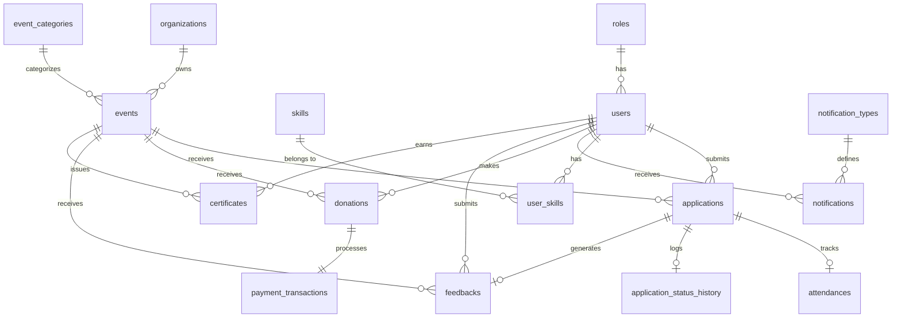

# DATABASE.md — VMS Database Schema & Ownership

**Version**: 2.0  
**Last Updated**: 2026-06-28  
**Purpose**: Định nghĩa schema, ownership, constraints và cross-module contracts cho Volunteer Management System (VMS).

---

## Table of Contents

1. [Schema Overview](#schema-overview)
2. [Entity Relationship Diagram](#entity-relationship-diagram)
3. [Table Specifications](#table-specifications)
4. [Module Ownership](#module-ownership)
5. [Cross-Module Contracts](#cross-module-contracts) — *See `share_context.md` for detailed contracts*
6. [Transaction Boundaries](#transaction-boundaries)
7. [Immutability Rules](#immutability-rules)
8. [Migration Strategy](#migration-strategy)
9. [Query Performance Guidelines](#query-performance-guidelines)
10. [Derived View Pattern](#derived-view-pattern)
11. [Prisma Schema Reference](#prisma-schema-reference)
12. [Security Checklist](#security-checklist)

---

## 1. Schema Overview

VMS sử dụng **18 physical tables** và **1 derived view pattern** (volunteer_history).

### Core Tables by Domain

| Domain | Tables | Owner |
|--------|--------|-------|
| **Authentication** | users, roles, user_sessions, login_attempts, email_verifications, password_resets | Member 1 |
| **Events** | events, event_categories | Member 3, Member 4 |
| **Applications** | applications, application_status_history | Member 3 |
| **Skills** | skills, user_skills | Member 4, Member 1 |
| **Attendance** | attendances | Member 3 |
| **Certificates** | certificates | Member 3 |
| **Feedback** | feedbacks | Member 2, Member 3 |
| **Organizations** | organizations | Member 5 |
| **Notifications** | notifications, notification_types | Member 5 |
| **Donations** | donations, payment_transactions | Member 5 |

### Derived Views

| View | Source Tables | Owner |
|------|---------------|-------|
| **volunteer_history** | applications + attendances + feedbacks + certificates | Member 1 |

---

## 2. Entity Relationship Diagram



---

## 3. Table Specifications

### 3.1 Authentication & User Management

---

#### Table: `roles`

**Owner**: Member 1 - CuongLH  
**Purpose**: Định nghĩa các vai trò trong hệ thống  
**Soft Delete**: No (master data, rarely changes)

**Columns**:

| Column | Type | Constraints | Description |
|--------|------|-------------|-------------|
| id | INT | PRIMARY KEY, AUTO_INCREMENT | Role ID |
| name | VARCHAR(50) | UNIQUE, NOT NULL | Role name (VOLUNTEER, STAFF, MANAGER, ADMIN) |
| description | VARCHAR(255) | NULL | Role description |
| created_at | TIMESTAMP | DEFAULT CURRENT_TIMESTAMP | |

**Indexes**:

- PRIMARY KEY (id)
- UNIQUE (name)

**Seed Data**:

```sql
INSERT INTO roles (name, description) VALUES
('VOLUNTEER', 'Tình nguyện viên tham gia sự kiện'),
('STAFF', 'Nhân viên quản lý sự kiện và xét duyệt'),
('MANAGER', 'Quản lý cấp trung, quản lý danh mục'),
('ADMIN', 'Quản trị viên hệ thống');
```

---

#### Table: `users`

**Owner**: Member 1 - CuongLH  
**Purpose**: Lưu trữ tài khoản người dùng  
**Soft Delete**: Yes (is_active)

**Columns**:

| Column | Type | Constraints | Description |
|--------|------|-------------|-------------|
| id | INT | PRIMARY KEY, AUTO_INCREMENT | User ID |
| email | VARCHAR(255) | UNIQUE, NOT NULL | Email đăng nhập |
| password_hash | VARCHAR(255) | NOT NULL | Bcrypt hash (12 rounds) |
| full_name | VARCHAR(255) | NOT NULL | Họ tên đầy đủ |
| phone | VARCHAR(20) | NULL | Số điện thoại |
| avatar_url | VARCHAR(500) | NULL | Cloudinary URL |
| role_id | INT | FOREIGN KEY → roles.id, NOT NULL | Vai trò |
| is_active | BOOLEAN | DEFAULT TRUE, NOT NULL | Trạng thái hoạt động |
| email_verified | BOOLEAN | DEFAULT FALSE, NOT NULL | Email đã xác thực |
| created_at | TIMESTAMP | DEFAULT CURRENT_TIMESTAMP | |
| updated_at | TIMESTAMP | ON UPDATE CURRENT_TIMESTAMP | |

**Indexes**:

- PRIMARY KEY (id)
- UNIQUE (email)
- INDEX (role_id)
- INDEX (is_active)
- INDEX (email_verified)

**Business Rules**:

- Password MUST be bcrypt hashed với BCRYPT_SALT_ROUNDS từ .env (default: 12)
- Email MUST be unique và verified (email_verified = TRUE) trước khi login
- Soft delete only: Set is_active = FALSE, KHÔNG xóa vật lý
- API response MUST NOT include password_hash field

---

#### Table: `user_sessions`

**Owner**: Member 1 - CuongLH  
**Purpose**: Single Active Session enforcement (JWT jti tracking)  
**Soft Delete**: No (auto-expire via TTL)

**Columns**:

| Column | Type | Constraints | Description |
|--------|------|-------------|-------------|
| id | INT | PRIMARY KEY, AUTO_INCREMENT | Session ID |
| user_id | INT | UNIQUE, FOREIGN KEY → users.id | User sở hữu session |
| jti | VARCHAR(255) | NOT NULL | JWT ID (unique identifier) |
| expires_at | TIMESTAMP | NOT NULL | Session expiry time |
| created_at | TIMESTAMP | DEFAULT CURRENT_TIMESTAMP | |

**Indexes**:

- PRIMARY KEY (id)
- UNIQUE (user_id)
- INDEX (jti)
- INDEX (expires_at)

**Business Rules**:

- 1 user chỉ có 1 active session (enforced by UNIQUE constraint on user_id)
- Khi user login mới, ghi đè jti cũ bằng jti mới (UPDATE existing record)
- Middleware xác thực MUST check: jti trong JWT === jti trong user_sessions
- Cleanup: Xóa sessions có expires_at < NOW() qua cron job

---

#### Table: `login_attempts`

**Owner**: Member 1 - CuongLH  
**Purpose**: Account lockout tracking (brute-force protection)  
**Soft Delete**: No (auto-expire via TTL)

**Columns**:

| Column | Type | Constraints | Description |
|--------|------|-------------|-------------|
| id | INT | PRIMARY KEY, AUTO_INCREMENT | Attempt ID |
| email | VARCHAR(255) | NOT NULL | Email đang bị track |
| attempts | INT | DEFAULT 0, NOT NULL | Số lần nhập sai |
| locked_until | TIMESTAMP | NULL | Thời điểm mở khóa |
| created_at | TIMESTAMP | DEFAULT CURRENT_TIMESTAMP | |
| updated_at | TIMESTAMP | ON UPDATE CURRENT_TIMESTAMP | |

**Indexes**:

- PRIMARY KEY (id)
- UNIQUE (email)
- INDEX (locked_until)

**Business Rules**:

- Sau 5 lần nhập sai liên tiếp: locked_until = NOW() + 15 minutes
- Login thành công: DELETE record hoặc SET attempts = 0
- WHERE locked_until > NOW(): Từ chối login dù password đúng

---

#### Table: `email_verifications`

**Owner**: Member 1 - CuongLH  
**Purpose**: Email verification tokens (UC62)  
**Soft Delete**: No (delete after verification)

**Columns**:

| Column | Type | Constraints | Description |
|--------|------|-------------|-------------|
| id | INT | PRIMARY KEY, AUTO_INCREMENT | Verification ID |
| user_id | INT | FOREIGN KEY → users.id | User cần verify |
| token | VARCHAR(255) | UNIQUE, NOT NULL | Verification token |
| expires_at | TIMESTAMP | NOT NULL | Token expiry (24 hours) |
| created_at | TIMESTAMP | DEFAULT CURRENT_TIMESTAMP | |

**Indexes**:

- PRIMARY KEY (id)
- UNIQUE (token)
- INDEX (user_id)
- INDEX (expires_at)

**Business Rules**:

- Token expires sau 24 giờ
- Sau verify thành công: UPDATE users.email_verified = TRUE và DELETE token
- 1 user chỉ có 1 active token (DELETE old token trước khi tạo mới)

---

#### Table: `password_resets`

**Owner**: Member 1 - CuongLH  
**Purpose**: Password reset tokens (UC07)  
**Soft Delete**: No (delete after reset)

**Columns**:

| Column | Type | Constraints | Description |
|--------|------|-------------|-------------|
| id | INT | PRIMARY KEY, AUTO_INCREMENT | Reset ID |
| user_id | INT | FOREIGN KEY → users.id | User yêu cầu reset |
| token | VARCHAR(255) | UNIQUE, NOT NULL | Reset token |
| expires_at | TIMESTAMP | NOT NULL | Token expiry (1 hour) |
| used | BOOLEAN | DEFAULT FALSE, NOT NULL | Đã sử dụng chưa |
| created_at | TIMESTAMP | DEFAULT CURRENT_TIMESTAMP | |

**Indexes**:

- PRIMARY KEY (id)
- UNIQUE (token)
- INDEX (user_id)
- INDEX (expires_at, used)

**Business Rules**:

- Token expires sau 1 giờ
- Sau reset thành công: SET used = TRUE (không delete để audit)
- WHERE used = TRUE hoặc expires_at < NOW(): Từ chối reset

---

### 3.2 Skills Management

---

#### Table: `skills`

**Owner**: Member 4 - AnhND  
**Purpose**: Danh mục kỹ năng tình nguyện  
**Soft Delete**: Yes (is_active)

**Columns**:

| Column | Type | Constraints | Description |
|--------|------|-------------|-------------|
| id | INT | PRIMARY KEY, AUTO_INCREMENT | Skill ID |
| name | VARCHAR(255) | UNIQUE, NOT NULL | Tên kỹ năng (VD: "Giao tiếp", "Tiếng Anh") |
| description | TEXT | NULL | Mô tả kỹ năng |
| is_active | BOOLEAN | DEFAULT TRUE, NOT NULL | Trạng thái hoạt động |
| created_at | TIMESTAMP | DEFAULT CURRENT_TIMESTAMP | |
| updated_at | TIMESTAMP | ON UPDATE CURRENT_TIMESTAMP | |

**Indexes**:

- PRIMARY KEY (id)
- UNIQUE (name)
- INDEX (is_active)

**Business Rules**:

- Soft delete only: Set is_active = FALSE
- Queries MUST filter WHERE is_active = TRUE

---

#### Table: `user_skills`

**Owner**: Member 1 - CuongLH (profile), Member 4 - AnhND (skills)  
**Purpose**: Many-to-many: Users ↔ Skills  
**Soft Delete**: No (hard delete khi unlink)

**Columns**:

| Column | Type | Constraints | Description |
|--------|------|-------------|-------------|
| id | INT | PRIMARY KEY, AUTO_INCREMENT | Link ID |
| user_id | INT | FOREIGN KEY → users.id | User |
| skill_id | INT | FOREIGN KEY → skills.id | Skill |
| created_at | TIMESTAMP | DEFAULT CURRENT_TIMESTAMP | |

**Indexes**:

- PRIMARY KEY (id)
- UNIQUE (user_id, skill_id)
- INDEX (user_id)
- INDEX (skill_id)

**Business Rules**:

- 1 user có thể có nhiều skills
- 1 skill có thể thuộc nhiều users
- Không duplicate: UNIQUE constraint (user_id, skill_id)

---

### 3.3 Organizations

---

#### Table: `organizations`

**Owner**: Member 5 - DucNM  
**Purpose**: Tổ chức chủ quản sự kiện  
**Soft Delete**: Yes (is_active)

**Columns**:

| Column | Type | Constraints | Description |
|--------|------|-------------|-------------|
| id | INT | PRIMARY KEY, AUTO_INCREMENT | Organization ID |
| name | VARCHAR(255) | NOT NULL | Tên tổ chức |
| email | VARCHAR(255) | NULL | Email liên hệ |
| phone | VARCHAR(20) | NULL | Số điện thoại |
| address | TEXT | NULL | Địa chỉ |
| website | VARCHAR(500) | NULL | Website |
| logo_url | VARCHAR(500) | NULL | Cloudinary URL |
| description | TEXT | NULL | Giới thiệu tổ chức |
| is_active | BOOLEAN | DEFAULT TRUE, NOT NULL | Trạng thái hoạt động |
| created_at | TIMESTAMP | DEFAULT CURRENT_TIMESTAMP | |
| updated_at | TIMESTAMP | ON UPDATE CURRENT_TIMESTAMP | |

**Indexes**:

- PRIMARY KEY (id)
- INDEX (is_active)

**Business Rules**:

- Soft delete only: Set is_active = FALSE
- Staff/Manager chỉ thấy organizations có is_active = TRUE
- Admin thấy cả active và inactive

---

### 3.4 Events & Categories

---

#### Table: `event_categories`

**Owner**: Member 4 - AnhND  
**Purpose**: Phân loại sự kiện (Location, Time, Type)  
**Soft Delete**: Yes (is_active)

**Columns**:

| Column | Type | Constraints | Description |
|--------|------|-------------|-------------|
| id | INT | PRIMARY KEY, AUTO_INCREMENT | Category ID |
| name | VARCHAR(255) | NOT NULL | Tên danh mục |
| category_type | ENUM('LOCATION', 'TIME', 'TYPE') | NOT NULL | Loại danh mục |
| description | TEXT | NULL | Mô tả |
| is_active | BOOLEAN | DEFAULT TRUE, NOT NULL | Trạng thái hoạt động |
| created_at | TIMESTAMP | DEFAULT CURRENT_TIMESTAMP | |
| updated_at | TIMESTAMP | ON UPDATE CURRENT_TIMESTAMP | |

**Indexes**:

- PRIMARY KEY (id)
- UNIQUE (name, category_type)
- INDEX (category_type, is_active)

**Business Rules**:

- Composite UNIQUE: (name, category_type) — cùng tên nhưng khác type được phép
- Composite INDEX: (category_type, is_active) — optimize filter queries
- Soft delete only

**Seed Data Examples**:

- LOCATION: "Hà Nội", "TP.HCM", "Đà Nẵng"
- TIME: "Cuối tuần", "Buổi tối", "Toàn thời gian"
- TYPE: "Giáo dục", "Môi trường", "Y tế", "Cộng đồng"

---

#### Table: `events`

**Owner**: Member 3 - TienTD  
**Purpose**: Sự kiện tình nguyện  
**Soft Delete**: Yes (is_active)

**Columns**:

| Column | Type | Constraints | Description |
|--------|------|-------------|-------------|
| id | INT | PRIMARY KEY, AUTO_INCREMENT | Event ID |
| title | VARCHAR(500) | NOT NULL | Tiêu đề sự kiện |
| description | TEXT | NOT NULL | Mô tả chi tiết |
| location | VARCHAR(500) | NOT NULL | Địa điểm |
| start_date | DATETIME | NOT NULL | Thời gian bắt đầu |
| end_date | DATETIME | NOT NULL | Thời gian kết thúc |
| application_deadline | DATETIME | NOT NULL | Hạn đăng ký |
| max_capacity | INT | NOT NULL, CHECK (max_capacity > 0) | Số lượng tối đa |
| approved_participants | INT | DEFAULT 0, NOT NULL | Số người đã approved |
| image_url | VARCHAR(500) | NULL | Cloudinary URL |
| organization_id | INT | FOREIGN KEY → organizations.id | Tổ chức chủ quản |
| category_id | INT | FOREIGN KEY → event_categories.id | Danh mục |
| created_by | INT | FOREIGN KEY → users.id | Staff tạo event |
| status | ENUM('DRAFT', 'PUBLISHED', 'IN_PROGRESS', 'COMPLETED', 'CANCELLED') | DEFAULT 'DRAFT' | Trạng thái |
| is_active | BOOLEAN | DEFAULT TRUE, NOT NULL | Soft delete flag |
| created_at | TIMESTAMP | DEFAULT CURRENT_TIMESTAMP | |
| updated_at | TIMESTAMP | ON UPDATE CURRENT_TIMESTAMP | |

**Indexes**:

- PRIMARY KEY (id)
- INDEX (organization_id)
- INDEX (category_id)
- INDEX (created_by)
- INDEX (status, is_active)
- INDEX (start_date)
- INDEX (application_deadline)
- INDEX (category_id, status, is_active, start_date) -- Composite index for volunteer search/filter (UC10-UC11)

**Business Rules**:

- **CRITICAL**: `approved_participants <= max_capacity` MUST be enforced ở Service layer
- Staff chỉ edit/delete event của tổ chức mình quản lý
- Soft delete only: Set is_active = FALSE
- WHERE status = 'IN_PROGRESS' hoặc 'COMPLETED': KHÔNG cho phép edit các thông tin cốt lõi

**Constraint Check**:

```sql
-- Service layer MUST validate BEFORE approve application:
SELECT approved_participants, max_capacity 
FROM events 
WHERE id = ? 
FOR UPDATE;  -- Lock row for transaction

-- IF approved_participants >= max_capacity THEN reject approval
```

---

### 3.5 Applications & Status History

---

#### Table: `applications`

**Owner**: Member 3 - TienTD  
**Purpose**: Đơn đăng ký tham gia sự kiện  
**Soft Delete**: No (state transition only)

**Columns**:

| Column | Type | Constraints | Description |
|--------|------|-------------|-------------|
| id | INT | PRIMARY KEY, AUTO_INCREMENT | Application ID |
| user_id | INT | FOREIGN KEY → users.id | Volunteer đăng ký |
| event_id | INT | FOREIGN KEY → events.id | Sự kiện |
| status | ENUM('PENDING', 'APPROVED', 'REJECTED', 'CANCELLED') | DEFAULT 'PENDING' | Trạng thái |
| message | TEXT | NULL | Lời nhắn từ volunteer |
| processed_by | INT | FOREIGN KEY → users.id, NULL | Staff xét duyệt |
| processed_at | TIMESTAMP | NULL | Thời gian xét duyệt |
| created_at | TIMESTAMP | DEFAULT CURRENT_TIMESTAMP | |
| updated_at | TIMESTAMP | ON UPDATE CURRENT_TIMESTAMP | |

**Indexes**:

- PRIMARY KEY (id)
- UNIQUE (user_id, event_id)
- INDEX (user_id, status)
- INDEX (event_id, status)
- INDEX (processed_by)

**Business Rules**:

- **UNIQUE constraint**: (user_id, event_id) — 1 volunteer chỉ apply 1 lần/event
- **State machine**: PENDING → [APPROVED | REJECTED] (one-way, KHÔNG quay lại PENDING)
- CANCELLED: Volunteer tự hủy khi status = PENDING
- Khi approve: INCREMENT events.approved_participants (transaction)
- Khi reject/cancel: KHÔNG ảnh hưởng approved_participants

---

#### Table: `application_status_history`

**Owner**: Member 3 - TienTD  
**Purpose**: Audit log cho status transitions  
**Soft Delete**: No (immutable audit data)

**Columns**:

| Column | Type | Constraints | Description |
|--------|------|-------------|-------------|
| id | INT | PRIMARY KEY, AUTO_INCREMENT | History ID |
| application_id | INT | FOREIGN KEY → applications.id | Application |
| old_status | ENUM('PENDING', 'APPROVED', 'REJECTED', 'CANCELLED') | NULL | Trạng thái cũ (NULL nếu mới tạo) |
| new_status | ENUM('PENDING', 'APPROVED', 'REJECTED', 'CANCELLED') | NOT NULL | Trạng thái mới |
| changed_by | INT | FOREIGN KEY → users.id | Staff/Volunteer thực hiện |
| reason | TEXT | NULL | Lý do (required khi REJECT) |
| changed_at | TIMESTAMP | DEFAULT CURRENT_TIMESTAMP | |

**Indexes**:

- PRIMARY KEY (id)
- INDEX (application_id, changed_at)
- INDEX (changed_by)

**Business Rules**:

- Immutable: KHÔNG được UPDATE/DELETE records
- Service MUST write to this table TRƯỚC KHI update applications.status (transaction)
- WHERE new_status = 'REJECTED': reason MUST NOT be NULL

---

### 3.6 Attendance & Certificates

---

#### Table: `attendances`

**Owner**: Member 3 - TienTD  
**Purpose**: Điểm danh sự kiện  
**Soft Delete**: No (immutable participation data)

**Columns**:

| Column | Type | Constraints | Description |
|--------|------|-------------|-------------|
| id | INT | PRIMARY KEY, AUTO_INCREMENT | Attendance ID |
| application_id | INT | UNIQUE, FOREIGN KEY → applications.id | Application đã approved |
| status | ENUM('PRESENT', 'ABSENT') | NOT NULL | Trạng thái điểm danh |
| volunteer_hours | DECIMAL(5,2) | NULL | Số giờ tình nguyện |
| checked_in_by | INT | FOREIGN KEY → users.id | Staff điểm danh |
| checked_in_at | TIMESTAMP | DEFAULT CURRENT_TIMESTAMP | Thời gian điểm danh |
| notes | TEXT | NULL | Ghi chú |

**Indexes**:

- PRIMARY KEY (id)
- UNIQUE (application_id)
- INDEX (checked_in_by)
- INDEX (checked_in_at)

**Business Rules**:

- **UNIQUE constraint**: application_id — 1 application chỉ có 1 attendance record
- Chỉ tạo attendance cho applications có status = 'APPROVED'
- Immutable: Sau khi tạo, KHÔNG được UPDATE status hoặc checked_in_at
- volunteer_hours được tính từ event duration hoặc do Staff nhập thủ công

---

#### Table: `certificates`

**Owner**: Member 3 - TienTD  
**Purpose**: Chứng nhận hoàn thành sự kiện  
**Soft Delete**: No (immutable)

**Columns**:

| Column | Type | Constraints | Description |
|--------|------|-------------|-------------|
| id | INT | PRIMARY KEY, AUTO_INCREMENT | Certificate ID |
| user_id | INT | FOREIGN KEY → users.id | Volunteer nhận chứng nhận |
| event_id | INT | FOREIGN KEY → events.id | Sự kiện |
| certificate_url | VARCHAR(500) | NOT NULL | Cloudinary URL hoặc PDF path |
| issued_by | INT | FOREIGN KEY → users.id | Staff tạo certificate |
| issued_at | TIMESTAMP | DEFAULT CURRENT_TIMESTAMP | |

**Indexes**:

- PRIMARY KEY (id)
- UNIQUE (user_id, event_id)
- INDEX (user_id)
- INDEX (event_id)
- INDEX (issued_by)

**Business Rules**:

- **UNIQUE constraint**: (user_id, event_id) — 1 volunteer tối đa 1 certificate/event
- Chỉ tạo certificate cho volunteers có attendance record với status = 'PRESENT'
- Immutable: KHÔNG được UPDATE certificate_url sau khi issued
- certificate_url MUST exist trên Cloudinary trước khi volunteer download

---

### 3.7 Feedback

---

#### Table: `feedbacks`

**Owner**: Member 2 - NamLD (submit via UC48), Member 3 - TienTD (view via UC49-UC50)  
**Purpose**: Đánh giá sự kiện từ volunteers  
**Soft Delete**: No (immutable)

**Columns**:

| Column | Type | Constraints | Description |
|--------|------|-------------|-------------|
| id | INT | PRIMARY KEY, AUTO_INCREMENT | Feedback ID |
| application_id | INT | UNIQUE, FOREIGN KEY → applications.id | Application |
| user_id | INT | FOREIGN KEY → users.id | Volunteer gửi feedback |
| event_id | INT | FOREIGN KEY → events.id | Sự kiện |
| rating | INT | CHECK (rating BETWEEN 1 AND 5), NULL | Đánh giá (1-5 sao) |
| comment | TEXT | NOT NULL | Nhận xét |
| status | ENUM('DRAFT', 'SUBMITTED') | DEFAULT 'SUBMITTED', NOT NULL | Trạng thái feedback |
| created_at | TIMESTAMP | DEFAULT CURRENT_TIMESTAMP | |
| updated_at | TIMESTAMP | ON UPDATE CURRENT_TIMESTAMP | |

**Indexes**:

- PRIMARY KEY (id)
- UNIQUE (application_id)
- INDEX (user_id)
- INDEX (event_id, rating, created_at)
- INDEX (status)

**Business Rules**:

- **UNIQUE constraint**: application_id — 1 volunteer chỉ feedback 1 lần/event
- Chỉ tạo feedback cho volunteers có attendance với status = 'PRESENT'
- Immutable: Sau khi status = 'SUBMITTED', KHÔNG được UPDATE rating/comment
- comment MUST NOT be empty
- Default status = 'SUBMITTED' (no draft functionality in MVP)

---

### 3.8 Notifications

---

#### Table: `notification_types`

**Owner**: Member 5 - DucNM  
**Purpose**: Định nghĩa loại thông báo  
**Soft Delete**: No (master data)

**Columns**:

| Column | Type | Constraints | Description |
|--------|------|-------------|-------------|
| id | INT | PRIMARY KEY, AUTO_INCREMENT | Type ID |
| name | VARCHAR(100) | UNIQUE, NOT NULL | Tên loại (VD: "APPLICATION_APPROVED") |
| description | VARCHAR(255) | NULL | Mô tả |
| created_at | TIMESTAMP | DEFAULT CURRENT_TIMESTAMP | |

**Indexes**:

- PRIMARY KEY (id)
- UNIQUE (name)

**Seed Data Examples**:

- APPLICATION_APPROVED
- APPLICATION_REJECTED
- EVENT_REMINDER
- CERTIFICATE_READY
- SYSTEM_ANNOUNCEMENT

---

#### Table: `notifications`

**Owner**: Member 5 - DucNM  
**Purpose**: Thông báo hệ thống gửi đến users  
**Soft Delete**: No (mark as read instead)

**Columns**:

| Column | Type | Constraints | Description |
|--------|------|-------------|-------------|
| id | INT | PRIMARY KEY, AUTO_INCREMENT | Notification ID |
| user_id | INT | FOREIGN KEY → users.id | User nhận thông báo |
| type_id | INT | FOREIGN KEY → notification_types.id | Loại thông báo |
| title | VARCHAR(255) | NOT NULL | Tiêu đề |
| message | TEXT | NOT NULL | Nội dung |
| reference_type | ENUM('EVENT', 'APPLICATION', 'CERTIFICATE', 'SYSTEM') | NULL | Loại tham chiếu |
| reference_id | INT | NULL | ID của entity được tham chiếu |
| is_read | BOOLEAN | DEFAULT FALSE, NOT NULL | Đã đọc chưa |
| created_at | TIMESTAMP | DEFAULT CURRENT_TIMESTAMP | |
| read_at | TIMESTAMP | NULL | Thời gian đọc |

**Indexes**:

- PRIMARY KEY (id)
- INDEX (user_id, is_read)
- INDEX (user_id, created_at)
- INDEX (type_id)
- INDEX (reference_type, reference_id)

**Business Rules**:

- Notifications KHÔNG được xóa, chỉ đánh dấu is_read = TRUE
- Frontend polling mỗi 30s để lấy unread_count
- WHERE is_read = FALSE: Hiển thị badge số lượng chưa đọc

**Notification Channels** (See `.sdd/DucNM/MD17-notification-system/spec.md` for detailed routing):

Current implementation supports:
- **IN_APP**: Stored in `notifications` table, retrieved via REST API
- **EMAIL**: Routed via EmailService (Member 1), sent to user email
- **PUSH**: Reserved for future mobile app implementation

Routing logic is managed by `NotificationService.route()` based on `notification_types.channel_types` configuration. Each type can specify which channels to use (e.g., APPLICATION_APPROVED → [EMAIL, IN_APP]).

---

### 3.9 Donations & Payment

---

#### Table: `donations`

**Owner**: Member 5 - DucNM  
**Purpose**: Quyên góp cho sự kiện  
**Soft Delete**: No (immutable transaction data)

**Columns**:

| Column | Type | Constraints | Description |
|--------|------|-------------|-------------|
| id | INT | PRIMARY KEY, AUTO_INCREMENT | Donation ID |
| user_id | INT | FOREIGN KEY → users.id | User quyên góp |
| event_id | INT | FOREIGN KEY → events.id | Sự kiện nhận quyên góp |
| amount | DECIMAL(15,2) | NOT NULL, CHECK (amount >= 10000) | Số tiền (VND) |
| status | ENUM('PENDING', 'SUCCESS', 'FAILED', 'CANCELLED') | DEFAULT 'PENDING' | Trạng thái |
| created_at | TIMESTAMP | DEFAULT CURRENT_TIMESTAMP | |
| updated_at | TIMESTAMP | ON UPDATE CURRENT_TIMESTAMP | |

**Indexes**:

- PRIMARY KEY (id)
- INDEX (user_id, created_at)
- INDEX (event_id, status)
- INDEX (status, created_at)

**Business Rules**:

- **IMMUTABLE**: WHERE status = 'SUCCESS', KHÔNG được UPDATE amount hoặc status
- Minimum amount: 10,000 VND
- Timeout: Pending > 30 phút → chuyển sang CANCELLED (cron job)
- Retry: Create NEW donation record, KHÔNG reuse existing

---

#### Table: `payment_transactions`

**Owner**: Member 5 - DucNM  
**Purpose**: Giao dịch thanh toán qua gateway  
**Soft Delete**: No (immutable transaction data)

**Columns**:

| Column | Type | Constraints | Description |
|--------|------|-------------|-------------|
| id | INT | PRIMARY KEY, AUTO_INCREMENT | Transaction ID |
| donation_id | INT | UNIQUE, FOREIGN KEY → donations.id | Donation (1-to-1) |
| payment_gateway | ENUM('VNPAY', 'MOMO') | NOT NULL | Cổng thanh toán |
| transaction_ref | VARCHAR(255) | UNIQUE | External gateway transaction ID |
| gateway_response | JSON | NULL | Raw webhook payload |
| signature_valid | BOOLEAN | NULL | Signature verification result |
| processed_at | TIMESTAMP | NULL | Thời gian xử lý webhook |
| created_at | TIMESTAMP | DEFAULT CURRENT_TIMESTAMP | |

**Indexes**:

- PRIMARY KEY (id)
- UNIQUE (donation_id)
- UNIQUE (transaction_ref)
- INDEX (payment_gateway)
- INDEX (processed_at)

**Business Rules**:

- **1-to-1 relationship**: UNIQUE constraint on donation_id
- Webhook signature MUST be validated trước khi update donation status
- WHERE signature_valid = FALSE: Log security warning, KHÔNG update donation
- gateway_response stores raw JSON for audit purposes

---

## 4. Module Ownership

### Ownership Matrix

| Module Owner | Tables Owned | Read-Only Access | Write Access |
|--------------|--------------|------------------|--------------|
| **Member 1 (CuongLH)** | users, roles, user_sessions, login_attempts, email_verifications, password_resets, user_skills (shared) | All tables | Own tables only |
| **Member 2 (NamLD)** | feedbacks (submit only), volunteer_history (view) | users, events, applications, attendances, certificates, feedbacks | feedbacks (insert only) |
| **Member 3 (TienTD)** | events, applications, application_status_history, attendances, certificates, feedbacks (view only) | users, organizations, event_categories | Own tables + INCREMENT events.approved_participants |
| **Member 4 (AnhND)** | skills, event_categories, user_skills (shared) | users | Own tables only |
| **Member 5 (DucNM)** | organizations, notifications, notification_types, donations, payment_transactions | users, events | Own tables only |

### Access Rules

1. **No Direct Repository Imports Across Modules**
   - Module A MUST NOT import Module B's Repository
   - Use Service layer contracts instead

2. **Read Access via Service Contracts**
   - Example: EventService.getById(eventId) — NOT direct query

3. **Write Access Requires Transaction Coordination**
   - Example: ApplicationService.approve() coordinates:
     - UPDATE applications.status
     - INSERT application_status_history
     - INCREMENT events.approved_participants (via EventService)

---

## 5. Cross-Module Contracts

### 5.1 User Module (Member 1)

**Provides**:

```javascript
// UserService.js
class UserService {
  async getById(userId) {
    // Returns: { id, email, full_name, role_id, is_active }
    // DOES NOT return: password_hash
  }
  
  async verifyRole(userId, requiredRole) {
    // Returns: boolean
  }
  
  async isActive(userId) {
    // Returns: boolean
  }
  
  async getUserSkills(userId) {
    // Returns: Array<{ skill_id, skill_name }>
  }
}
```

**Consumed by**: All modules need user identity verification

---

### 5.2 Event Module (Member 3)

**Provides**:

```javascript
// EventService.js
class EventService {
  async getById(eventId) {
    // Returns: Full event object
  }
  
  async checkCapacity(eventId) {
    // Returns: { approved_participants, max_capacity, available_slots }
  }
  
  async incrementParticipants(eventId, staffId) {
    // Transaction: FOR UPDATE lock + INCREMENT
    // Returns: { success: boolean, new_count: number }
  }
}
```

**Consumed by**: Application approval workflow (Member 3)

---

### 5.3 Application Module (Member 3)

**Provides**:

```javascript
// ApplicationService.js
class ApplicationService {
  async approveApplication(applicationId, staffId, reason) {
    // Transaction:
    // 1. Validate capacity via EventService.checkCapacity()
    // 2. UPDATE applications.status = 'APPROVED'
    // 3. INSERT application_status_history
    // 4. EventService.incrementParticipants()
    // Returns: { success: boolean, message: string }
  }
  
  async getByUserId(userId, status = null) {
    // Returns: Array of applications filtered by status
  }
}
```

**Consumed by**: Volunteer History (Member 1), Feedback submission (Member 2)

---

### 5.4 Attendance Module (Member 3)

**Provides**:

```javascript
// AttendanceService.js
class AttendanceService {
  async checkIn(applicationId, staffId, volunteerHours = null) {
    // Validates: application.status === 'APPROVED'
    // Creates: attendance record
    // Returns: { success: boolean, attendance_id: number }
  }
  
  async getByUserId(userId) {
    // Returns: Array of attendance records
  }
}
```

**Consumed by**: Certificate generation (Member 3), Volunteer History (Member 1)

---

### 5.6 Feedback Module (Member 2 submit, Member 3 view)

**Provides**:

```javascript
// FeedbackService.js (Member 2 + Member 3)
class FeedbackService {
  // Member 2: Submit feedback (UC48)
  async submitFeedback(userId, applicationId, data) {
    // Validates: attendance.status === 'PRESENT'
    // Validates: no existing feedback for this application
    // Creates: feedback record with status = 'SUBMITTED'
    // Returns: { success: boolean, feedback_id: number }
  }
  
  // Member 3: View feedback list (UC49)
  async getFeedbacksByEventId(eventId, filters = {}) {
    const { rating, sortBy = 'created_at', order = 'desc' } = filters;
    
    return await prisma.feedbacks.findMany({
      where: {
        event_id: eventId,
        status: 'SUBMITTED',
        ...(rating && { rating })
      },
      include: {
        user: { select: { id: true, full_name: true, avatar_url: true } }
      },
      orderBy: { [sortBy]: order }
    });
  }
  
  // Member 3: View feedback detail (UC50)
  async getFeedbackById(feedbackId) {
    return await prisma.feedbacks.findUnique({
      where: { id: feedbackId },
      include: {
        user: { select: { id: true, full_name: true, avatar_url: true } },
        event: { select: { id: true, title: true, start_date: true } },
        application: { select: { id: true, status: true } }
      }
    });
  }
}
```

**Consumed by**: Staff event management (Member 3), Volunteer History (Member 1)

---

### 5.5 Organization Module (Member 5)

**Provides**:

```javascript
// OrganizationService.js
class OrganizationService {
  async getById(orgId) {
    // Returns: Organization object
  }
  
  async getActiveOrganizations() {
    // Returns: Array of is_active = TRUE organizations
  }
}
```

**Consumed by**: Event creation (Member 3)

---

## 6. Transaction Boundaries

### Critical Operations Requiring Database Transactions

#### 6.1 Approve Application (Member 3)

**Why**: Đảm bảo capacity không vượt quá và audit log được ghi nhận

```javascript
async function approveApplication(applicationId, staffId, reason) {
  return await prisma.$transaction(async (tx) => {
    // 1. Lock event row
    const event = await tx.events.findUnique({
      where: { id: application.event_id },
      select: { approved_participants, max_capacity }
    });
    
    // 2. Validate capacity
    if (event.approved_participants >= event.max_capacity) {
      throw new Error('Event is full');
    }
    
    // 3. Get current application
    const app = await tx.applications.findUnique({
      where: { id: applicationId }
    });
    
    // 4. Insert audit log
    await tx.application_status_history.create({
      data: {
        application_id: applicationId,
        old_status: app.status,
        new_status: 'APPROVED',
        changed_by: staffId,
        reason
      }
    });
    
    // 5. Update application
    await tx.applications.update({
      where: { id: applicationId },
      data: { 
        status: 'APPROVED',
        processed_by: staffId,
        processed_at: new Date()
      }
    });
    
    // 6. Increment event participants
    await tx.events.update({
      where: { id: app.event_id },
      data: { approved_participants: { increment: 1 } }
    });
    
    return { success: true };
  });
}
```

---

#### 6.2 Create Donation + Payment Transaction (Member 5)

**Why**: 1-to-1 relationship phải được tạo atomically

```javascript
async function createDonation(userId, eventId, amount, gateway) {
  return await prisma.$transaction(async (tx) => {
    // 1. Create donation
    const donation = await tx.donations.create({
      data: {
        user_id: userId,
        event_id: eventId,
        amount,
        status: 'PENDING'
      }
    });
    
    // 2. Create payment transaction
    const payment = await tx.payment_transactions.create({
      data: {
        donation_id: donation.id,
        payment_gateway: gateway
      }
    });
    
    // 3. Generate payment URL (external API call - NOT in transaction)
    return { donation_id: donation.id, payment_id: payment.id };
  });
}
```

---

#### 6.3 Generate Certificate + Send Notification (Member 3 + Member 5)

**Why**: Certificate generation phải đồng bộ với notification creation để volunteer nhận thông báo ngay lập tức

```javascript
async function generateCertificateWithNotification(userId, eventId, staffId, certificateUrl) {
  return await prisma.$transaction(async (tx) => {
    // 1. Validate attendance exists and status = 'PRESENT'
    const attendance = await tx.attendances.findFirst({
      where: { 
        application: { 
          user_id: userId, 
          event_id: eventId,
          status: 'APPROVED'
        },
        status: 'PRESENT'
      },
      include: {
        application: { include: { event: { select: { title: true } } } }
      }
    });
    
    if (!attendance) {
      throw new Error('No valid attendance record found');
    }
    
    // 2. Check for duplicate certificate
    const existing = await tx.certificates.findUnique({
      where: { 
        user_id_event_id: { user_id: userId, event_id: eventId }
      }
    });
    
    if (existing) {
      throw new Error('Certificate already exists for this user and event');
    }
    
    // 3. Create certificate
    const certificate = await tx.certificates.create({
      data: {
        user_id: userId,
        event_id: eventId,
        certificate_url: certificateUrl, // Must be generated and uploaded BEFORE transaction
        issued_by: staffId
      }
    });
    
    // 4. Get notification type ID
    const notifType = await tx.notification_types.findUnique({
      where: { name: 'CERTIFICATE_READY' }
    });
    
    // 5. Create notification (cross-module: Member 5 owns notifications table)
    await tx.notifications.create({
      data: {
        user_id: userId,
        type_id: notifType.id,
        title: 'Chứng nhận đã sẵn sàng',
        message: `Chứng nhận cho sự kiện "${attendance.application.event.title}" đã được tạo. Bạn có thể xem và tải xuống ngay.`,
        reference_type: 'CERTIFICATE',
        reference_id: certificate.id
      }
    });
    
    return { success: true, certificate_id: certificate.id };
  });
}
```

---

#### 6.4 Approve Application + Send Notification (Member 3 + Member 5)

**Why**: Application approval phải trigger notification để volunteer biết đơn đã được duyệt

```javascript
async function approveApplicationWithNotification(applicationId, staffId, reason) {
  return await prisma.$transaction(async (tx) => {
    // Reuse approval logic from 6.1
    
    // 1. Lock event row
    const app = await tx.applications.findUnique({
      where: { id: applicationId },
      include: { event: { select: { id: true, title: true, approved_participants: true, max_capacity: true } } }
    });
    
    // 2. Validate capacity
    if (app.event.approved_participants >= app.event.max_capacity) {
      throw new Error('Event is full');
    }
    
    // 3. Insert audit log
    await tx.application_status_history.create({
      data: {
        application_id: applicationId,
        old_status: app.status,
        new_status: 'APPROVED',
        changed_by: staffId,
        reason
      }
    });
    
    // 4. Update application
    await tx.applications.update({
      where: { id: applicationId },
      data: { 
        status: 'APPROVED',
        processed_by: staffId,
        processed_at: new Date()
      }
    });
    
    // 5. Increment event participants
    await tx.events.update({
      where: { id: app.event_id },
      data: { approved_participants: { increment: 1 } }
    });
    
    // 6. Get notification type
    const notifType = await tx.notification_types.findUnique({
      where: { name: 'APPLICATION_APPROVED' }
    });
    
    // 7. Create notification (cross-module: Member 5)
    await tx.notifications.create({
      data: {
        user_id: app.user_id,
        type_id: notifType.id,
        title: 'Đơn đăng ký được chấp nhận',
        message: `Đơn đăng ký của bạn cho sự kiện "${app.event.title}" đã được chấp nhận. Vui lòng điểm danh đúng giờ.`,
        reference_type: 'APPLICATION',
        reference_id: applicationId
      }
    });
    
    return { success: true };
  });
}
```

---

## 7. Immutability Rules

### Tables with Immutable Records

| Table | Immutability Rule | Reason |
|-------|-------------------|--------|
| `application_status_history` | NEVER UPDATE/DELETE | Audit trail |
| `attendances` | NEVER UPDATE status/checked_in_at after creation | Participation proof |
| `certificates` | NEVER UPDATE certificate_url after issued | Legal document |
| `feedbacks` | NEVER UPDATE rating/comment after submit | Authentic review |
| `donations` | WHERE status = 'SUCCESS': NEVER UPDATE amount/status | Financial record |
| `payment_transactions` | NEVER UPDATE after processed_at is set | Gateway reconciliation |

### Enforcement Strategy

**Service Layer Validation**:

```javascript
// DonationService.js
async function updateDonation(donationId, newAmount) {
  const donation = await prisma.donations.findUnique({
    where: { id: donationId }
  });
  
  // ENFORCE IMMUTABILITY
  if (donation.status === 'SUCCESS') {
    throw new Error('Cannot modify successful donation. Create new donation instead.');
  }
  
  // Only PENDING/FAILED donations can be updated
  return await prisma.donations.update({
    where: { id: donationId },
    data: { amount: newAmount }
  });
}
```

---

## 8. Migration Strategy

### 8.1 Migration Order

Migrations MUST follow dependency order:

1. **Phase 1: Master Data**
   - `001_create_roles.sql`
   - `002_create_notification_types.sql`

2. **Phase 2: Core Entities**
   - `003_create_users.sql`
   - `004_create_organizations.sql`
   - `005_create_skills.sql`
   - `006_create_event_categories.sql`

3. **Phase 3: Auth & Session**
   - `007_create_user_sessions.sql`
   - `008_create_login_attempts.sql`
   - `009_create_email_verifications.sql`
   - `010_create_password_resets.sql`

4. **Phase 4: User Relations**
   - `011_create_user_skills.sql`

5. **Phase 5: Events**
   - `012_create_events.sql`

6. **Phase 6: Applications & Workflow**
   - `013_create_applications.sql`
   - `014_create_application_status_history.sql`
   - `015_create_attendances.sql`
   - `016_create_certificates.sql`
   - `017_create_feedbacks.sql`

7. **Phase 7: Notifications & Donations**
   - `018_create_notifications.sql`
   - `019_create_donations.sql`
   - `020_create_payment_transactions.sql`

### 8.2 Prisma Migrate Commands

**Migration files location**: `backend/prisma/migrations/`

```bash
# Create new migration
npx prisma migrate dev --name create_users

# Apply migrations
npx prisma migrate deploy

# Reset database (dev only)
npx prisma migrate reset

# Generate Prisma Client
npx prisma generate

# Check migration status
npx prisma migrate status
```

**Migration file naming**: Each migration auto-generates with timestamp: `20260628000000_create_users/`

**Generated artifacts**:
- `migration.sql` — SQL statements executed
- `migration_lock.toml` — Lock file to prevent concurrent migrations

### 8.3 Migration Rules

1. **NEVER edit existing migration files** — tạo migration mới để sửa
2. **Always backup production DB** trước khi migrate
3. **Test migrations in staging** trước khi deploy production
4. **Rollback plan**: Mỗi migration phải có script rollback tương ứng

---

## 9. Query Performance Guidelines

### 9.1 Index Strategy

**Always Indexed**:

- Primary keys (automatic)
- Foreign keys (manual index required)
- Unique constraints (automatic unique index)
- Soft delete filters: `is_active`
- Pagination/sort columns: `created_at`, `updated_at`

**Composite Indexes**:

```sql
-- Event queries: Filter by status AND soft delete
CREATE INDEX idx_events_status_active ON events(status, is_active);

-- Event search/filter (UC10-UC11): Category + Status + Active + Date
CREATE INDEX idx_events_category_status_active_date ON events(category_id, status, is_active, start_date);

-- Application queries: User's applications by status
CREATE INDEX idx_applications_user_status ON applications(user_id, status);

-- Notification queries: Unread notifications for user
CREATE INDEX idx_notifications_user_read ON notifications(user_id, is_read);

-- Category queries: Filter by type AND active
CREATE INDEX idx_categories_type_active ON event_categories(category_type, is_active);

-- Feedback queries: Event feedbacks with rating filter (UC49-UC50)
CREATE INDEX idx_feedbacks_event_rating_date ON feedbacks(event_id, rating, created_at);
```

### 9.2 Query Optimization Rules

1. **Soft Delete Queries**: ALWAYS filter by is_active
2. **Pagination**: Use indexed columns for ORDER BY
3. **Avoid N+1 Queries**: Use Prisma include/select
4. **Select Only Required Columns**: Never select password_hash in API responses

### 9.3 Soft Delete Validation at Query Level

**Critical Rule**: Foreign keys MUST validate `is_active = TRUE` trước khi create/update

```javascript
// EventService.js - Validate category is active
async function validateEventCategory(categoryId) {
  const category = await prisma.event_categories.findUnique({
    where: { id: categoryId }
  });
  
  if (!category || !category.is_active) {
    throw new Error('Category is inactive or does not exist');
  }
  
  return category;
}

// EventService.js - Validate organization is active
async function validateOrganization(organizationId) {
  const org = await prisma.organizations.findUnique({
    where: { id: organizationId }
  });
  
  if (!org || !org.is_active) {
    throw new Error('Organization is inactive or does not exist');
  }
  
  return org;
}

// ApplicationService.js - Validate user is active before allow apply
async function validateUserIsActive(userId) {
  const user = await prisma.users.findUnique({
    where: { id: userId, is_active: true }
  });
  
  if (!user) {
    throw new Error('User account is inactive');
  }
  
  return user;
}

// ApplicationService.js - Validate event is active before allow apply
async function validateEventIsActive(eventId) {
  const event = await prisma.events.findUnique({
    where: { id: eventId, is_active: true, status: 'PUBLISHED' }
  });
  
  if (!event) {
    throw new Error('Event is not available for application');
  }
  
  return event;
}
```

**Enforcement Strategy**:

- Service layer MUST call validation helpers BEFORE any CREATE/UPDATE operation
- Controllers MUST NOT bypass service layer validation
- Validation errors return 400 Bad Request with clear message

---

## 10. Derived View Pattern: Volunteer History

### 10.1 Why NOT a Physical Table?

**Decision**: Volunteer History is a **derived view**, NOT a physical table.

**Rationale** (per ADR-001, ADR-005):

- **Single Source of Truth**: applications, attendances, certificates, feedbacks are authoritative
- **No Data Drift**: Tránh sync issues
- **Audit Trail Preserved**: Soft delete ở source tables đủ cho audit

### 10.2 Service Layer Aggregation

```javascript
// VolunteerHistoryService.js (Member 1)
async getHistoryByUserId(userId) {
  return await prisma.applications.findMany({
    where: {
      user_id: userId,
      status: 'APPROVED',
      attendances: { isNot: null }
    },
    include: {
      event: { select: { id: true, title: true, start_date: true, location: true } },
      attendances: { select: { status: true, volunteer_hours: true } },
      feedbacks: { select: { id: true, rating: true, comment: true } },
      certificates: { select: { id: true, certificate_url: true, issued_at: true } }
    },
    orderBy: { event: { start_date: 'desc' } }
  });
}
```

---

## 11. Prisma Schema Reference

### 11.1 Schema File Location

```text
prisma/schema.prisma
```

### 11.2 Generate Prisma Client

```bash
# Generate Prisma Client after schema changes
npx prisma generate

# Format Prisma schema
npx prisma format

# Validate Prisma schema
npx prisma validate
```

### 11.3 Schema Generation Workflow

**IMPORTANT**: Do NOT manually write `schema.prisma` from scratch. Follow this workflow:

1. **Review DATABASE.md** (this file) - Single source of truth for schema design
2. **Create migration SQL** based on table specs in Section 3
3. **Run migration**: `npx prisma migrate dev --name <migration_name>`
4. **Prisma introspects database** and updates `schema.prisma` automatically
5. **Generate client**: `npx prisma generate`
6. **Validate**: Check generated schema matches DATABASE.md specs

### 11.4 Key Prisma Conventions

**Model Naming**:

- Database tables use `snake_case` (e.g., `user_skills`)
- Prisma models use `PascalCase` (e.g., `UserSkills`)
- Prisma auto-maps: `@@map("user_skills")`

**Relations**:

- 1-to-many: Use `@relation` on both sides
- Many-to-many: Use explicit join table (e.g., `user_skills`)
- Foreign keys: Prisma infers from `@relation` + field annotations

**Enums**:


```prisma
enum ApplicationStatus {
  PENDING
  APPROVED
  REJECTED
  CANCELLED
}
```

**Composite Unique Constraints**:


```prisma
model Application {
  // ...
  @@unique([user_id, event_id])
}
```

**Indexes**:


```prisma
model Event {
  // ...
  @@index([category_id, status, is_active, start_date])
  @@index([status, is_active])
}
```

### 11.5 Schema Validation Checklist

Before migrating to production:

- [ ] All tables from Section 3 are present in `schema.prisma`
- [ ] All columns match DATABASE.md specs (type, constraints, defaults)
- [ ] All indexes from Section 9 are defined
- [ ] All foreign keys have `@relation` annotations
- [ ] All enums match DATABASE.md definitions
- [ ] Soft delete fields (`is_active`) have correct defaults
- [ ] Timestamps (`created_at`, `updated_at`) use `@default` and `@updatedAt`
- [ ] Unique constraints match DATABASE.md specs
- [ ] Composite indexes are optimized for query patterns (UC10-UC11, UC49-UC50)

### 11.6 Migration Safety Rules

1. **NEVER edit existing migration files** - create new migration instead
2. **NEVER delete migration history** - breaks schema versioning
3. **Always backup production DB** before running migrations
4. **Test migrations in dev/staging** before production deploy
5. **Use `prisma migrate deploy`** in production (not `migrate dev`)
6. **Schema drift detection**: Run `prisma migrate status` to check for manual DB changes

---

## 12. Security Checklist

- [ ] Passwords MUST be bcrypt hashed (12 rounds)
- [ ] JWT stored in HttpOnly cookies ONLY
- [ ] API responses MUST NOT include password_hash, jti, tokens
- [ ] Soft delete for User, Event, Organization, Category, Skill
- [ ] Immutability enforced for audit tables
- [ ] Foreign key constraints enabled
- [ ] Input validation with Zod before database queries
- [ ] SQL injection prevention via Prisma parameterized queries
- [ ] Rate limiting for login endpoints (account lockout)
- [ ] Transaction isolation for critical operations
- [ ] Webhook signature validation for payment gateways

---

**End of DATABASE.md**

**Version**: 2.0  
**Status**: Ready for Implementation  
**Last Updated**: 2026-06-28  

**Changelog v2.0**:

- ✅ Added `feedbacks.status` field (DRAFT/SUBMITTED)
- ✅ Clarified feedbacks ownership (Member 2 submit UC48, Member 3 view UC49-UC50)
- ✅ Added composite index for events search/filter (UC10-UC11)
- ✅ Added composite index for feedbacks aggregation (UC49-UC50)
- ✅ Added FeedbackService.getFeedbacksByEventId() pattern
- ✅ Added transaction example 6.3: Generate Certificate + Notification
- ✅ Added transaction example 6.4: Approve Application + Notification
- ✅ Added soft delete validation patterns in Section 9.3
- ✅ Added comprehensive Prisma Schema Reference (Section 11)
- ✅ Updated volunteer history aggregation to include feedbacks + certificates

**Next Steps**:

1. Review DATABASE.md v2.0 với team (5 members)
2. Generate Prisma schema from migration workflow (Section 11.3)
3. Run migrations theo phân pha (Section 8.1)
4. Seed master data (roles, notification_types, categories)
5. Implement Service layer contracts (Section 5)
6. Write integration tests cho critical transactions (Section 6)

*Tham chiếu: CLAUDE.md, AGENTS.md, VMS_project_overview_updated.md, CONSTITUTION.md, share_context.md*

**Spec References** (.sdd folder structure):
- `.sdd/CuongLH/MD15-email-service/spec.md` — Email & Verification
- `.sdd/CuongLH/MD16-auth-service/spec.md` — Authentication & JWT
- `.sdd/NamLD/MD05-volunteer-event-discovery/spec.md` — Event List/Detail/Search
- `.sdd/NamLD/MD06-volunteer-application/spec.md` — Apply Event & Feedback
- `.sdd/TienTD/MD07-application-management/spec.md` — Application Approval/Rejection
- `.sdd/TienTD/MD08-attendance-management/spec.md` — Attendance Check-In
- `.sdd/TienTD/MD09-certificate-management/spec.md` — Certificate Generation
- `.sdd/AnhND/MD10-user-management/spec.md` — User CRUD & Filter
- `.sdd/AnhND/MD11-category-management/spec.md` — Category CRUD
- `.sdd/AnhND/MD12-skill-management/spec.md` — Skill CRUD
- `.sdd/DucNM/MD13-organization-management/spec.md` — Organization CRUD
- `.sdd/DucNM/MD14-donation-management/spec.md` — Donation & Payment Gateway
- `.sdd/DucNM/MD17-notification-system/spec.md` — Notifications & Channels
- `.sdd/DucNM/MD18-dashboard-reports/spec.md` — Dashboard & Analytics
